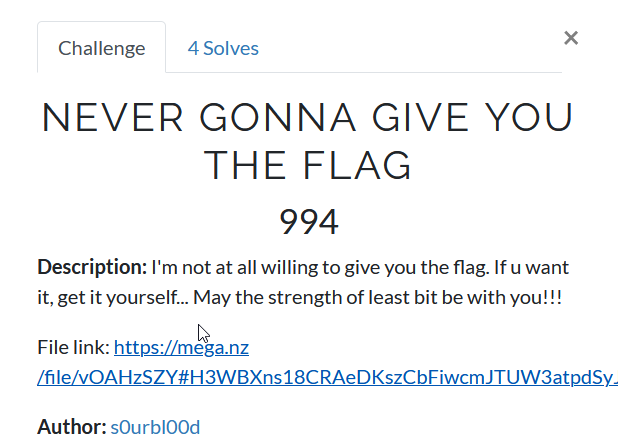
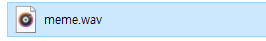
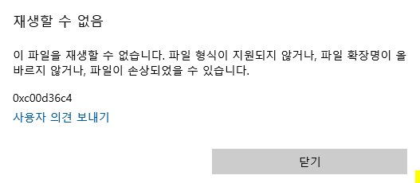
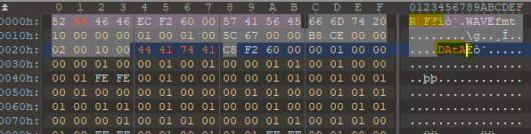
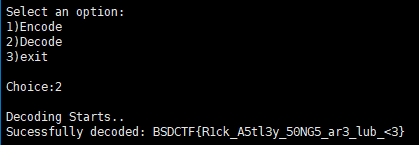

# NEVER GONNA GIVE YOU THE FLAG
### #LSB_steganography #forensic

문제 타이틀이다. **least bit** 의 힘이 당신과 함께할 것(?) 이라고 한다.

일단은 넘어가고 파일을 받아보자.

파일은 **meme.wav** 라는 음원파일이나, 실행하면 해당 오류가 뜬다.

일단 포렌식 문제이니 파일의 hex 값을 둘러보기로 하였다.

여기서 이상한 부분을 발견할 수 있다.

[.wav 파일의 구조](http://blog.naver.com/psychoria/40139175382)

> 일단 위 링크를 참고하면, `.wav` 파일의 헤더는 `RIFF` 로 시작하고, 데이터 부분의 시작은 `data` 의 소문자 문자열로 시작한다.

하지만, 파일을 보면 시작은 `RUFF` 로 시작하며, 데이터 부분 시작은 `DAtA` 이다.

이를 고쳐주고, 다시 재생하면 [RickRoll](https://www.youtube.com/watch?v=dQw4w9WgXcQ) 해당 노래가 재생이 되는 것을 알 수 있다.

플래그는 어디에 있을까? 여기서 다시 문제 타이틀을 복기하면, **least bit** 이라는 단어가 있다.

구글링을 해보니 **LSB steganography** 라는 것이 있었다.

> 요약하면 한 바이트의 맨 끝 비트에 원하는 문자열 혹은 데이터를 숨겨놓는 기술인데, 예를 들면 A(0b01000001) 의 각 비트를 바이너리의 각 바이트의 끝 비트와 & 혹은 xor 시켜서 숨기는 것을 말한다. [<참고자료>](https://whitesnake1004.tistory.com/573)

그리고 아래의 해당 툴을 이용하면, (만약 플래그가 있다면) 플래그를 추출할 수 있다.

[LSB restore tool](https://github.com/sniperline047/Audio-Steganography)

.

.

.

**Contact:** a42873410@gmail.com

