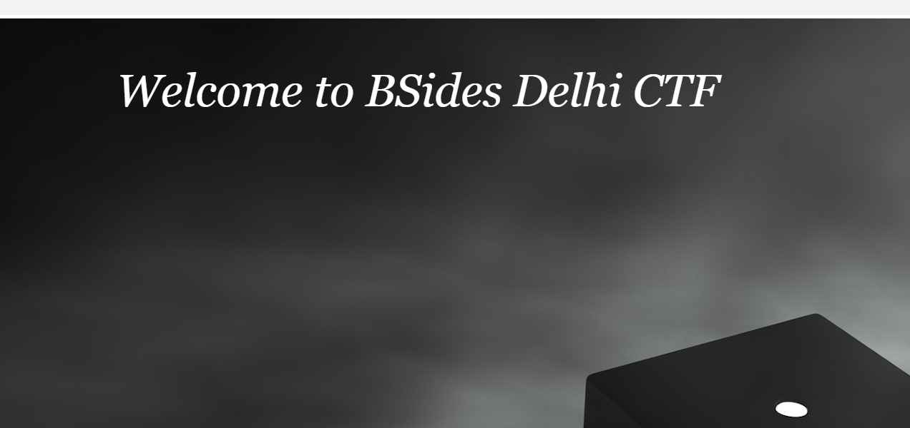
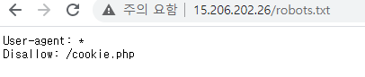
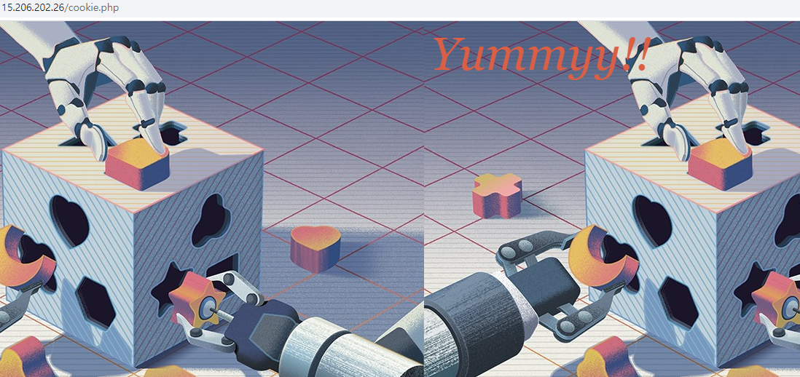
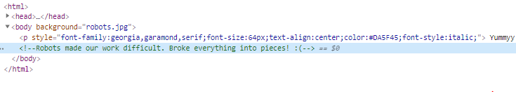
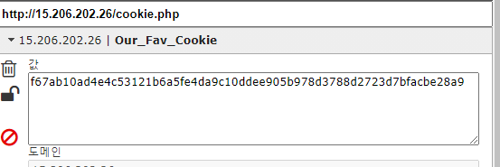
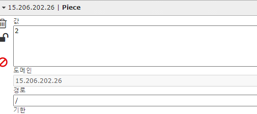
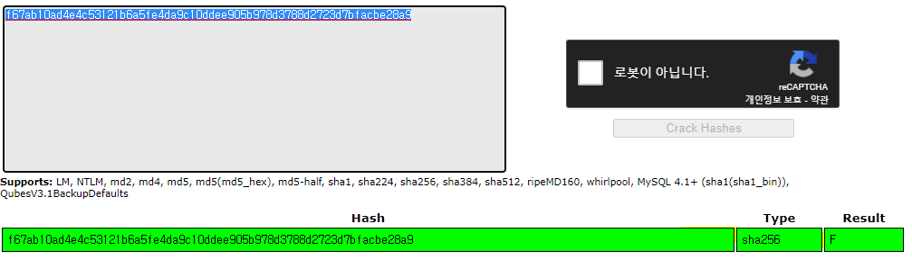
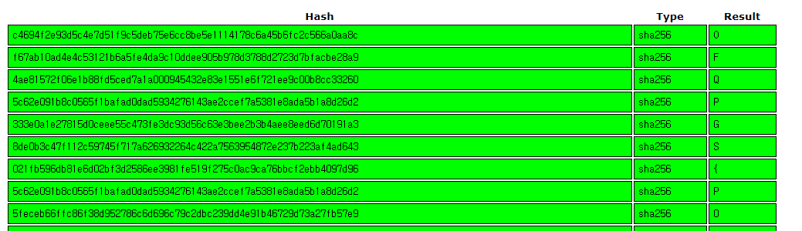

# Robot Master
### #sha256 #crack #robots.txt

처음 링크로 들어가면 메인화면은 다음과 같다.

문제 제목대로 `robots.txt` 파일을 열람하면, Disallow 조치 해놓은 경로를 찾을 수 있다.

해당 `/cookie.php` 경로로 들어가보자.

이미지 하나가 나와있다.

해당 페이지 주석에는 힌트를 주는 듯한 주석이 있었다. 우선은 페이지에 대한 쿠키를 살펴보자.

쿠키는 총 두 가지가 있었는데, `Our_Fav_Cookie` 는 해시 값인 듯한 값이고, `Piece` 는 단순한 숫자로 페이지를 새로고침 할때마다 1 씩 증가한다.

여기서 매우 헤맸는데, 그러다가 `Our_Fav_Cookie` 를 크래킹 해보기로 하였다.

해시의 정체는 **sha256** 으로 해싱된 값이었고, 해당 해시의 원본 값은 **'F'** 이다.

> 그리고 `Our_Fav_Cookie` 값 또한, 새로고침을 할 때마다 바뀌는데, 이는 `Piece` 값에 따라 고정된 해시값이 된다는 것을 알 수 있었다.

> 그리고 `Piece` 값은 1 ~ 39 의 값을 가질 수 있으므로 총 39개의 값만 알아내면 된다.

모두 크랙한 결과 플래그같이 생긴 것이 나온다.

`OFPGS{P00_x135_ne3_o35g_cy4p3_70_pu3px}`

이를 **ROT13** 디코딩을 하면 플래그가 나온다.

`BSCTF{C00_k135_ar3_b35t_pl4c3_70_ch3ck}`

.

.

.

**contact:** a42873410@gmail.com

