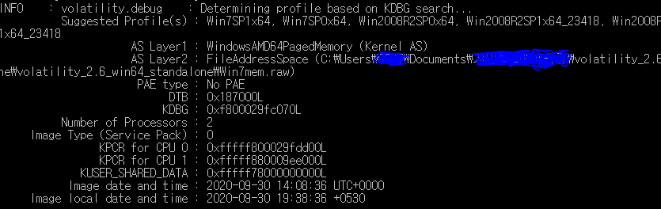
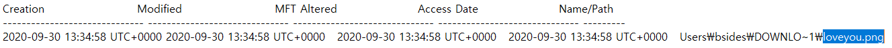
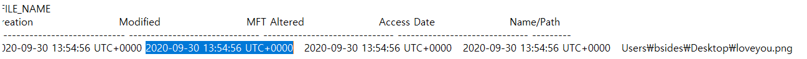

# Heisenberg's Password
### #volatility #forensic #MFT #NTFS

```
@문제설명

Description: Some undercover cops were trying to get info from a drug dealer named Heisenberg. He stored all the details of the drug mafia in an encrypted file in his PC. PC is with cops now. But they don't know the password. According to the Intelligence team, Heisenberg has weak memory and He used to store his strong password as different parts in different places in his wife's PC. The Intelligence team were able to collect his wife's PC memory dump. The Intelligence team informed us that getting the answers for given questions and setting them in a given format might give us the password. So could you help them to get the password?

PS: Follow the order of questions while wrapping the answers

When is the last time loveyou.png modified? eg: 2020-10-10_11:45:33

What is the physical offset of Loveletter text? eg: 0x000000007ac06539

When is the last time the MEGA link opened? eg: 2020-10-10_11:45:33

Wrap the answers in the format: BSDCTF{2020-10-10_11:45:337ac065392020-10-10_11:45:33}

FILE: https://mega.nz/file/2GZiADRJ#ganXTg-pbgFE6ely5DjtZsIuxpnIFduqeuRxfKTnIuM [ MEGA ]

Author: s0urbl00d
```

문제가 길다. 대강 설명을 하자면, 경찰이 Heisenberg 라는 마약상을 잡으려는데 Heisenberg 는 모든 마약 마피아들의 정보를 암호화된 파일에 놓았다고 한다. 그런데 여차저차해서 비밀번호 정보가 담긴 그의 와이프의 PC 메모리 덤프를 얻어왔다고 한다. 그리고 다음 질문들에 대한 답들이 플래그가 된다고 한다.

- **loveyou.png** 파일이 수정된 시각은?
- **Loveletter** 텍스트 파일의 물리적 오프셋 주소는?
- **MEGA** 링크가 오픈된 마지막 시간은?

**플래그는 위 3개의 답변을 이어서 완성한 결과이다.**


문제는 위의 메모리 덤프 파일 하나가 전부이다.

사용할 수 있는 툴은 **volatility** 가 우선적으로 생각 났다.

해당 이미지의 정보를 확인하기 위해 **volatility** 의 `imageinfo` 를 사용해보자.

`volatility_2.6_win64_standalone.exe imageinfo -f Win7mem.raw`



결과는 일단 이미지 profile 은 **Win7SP1x64, Win7SP0x64** 둘 중 하나로 추려진다.

서비스 팩 1 으로 이어나가 보자.

첫 번째 질문을 우선 해결해보자.

**loveyou.png** 파일의 마지막 수정시각을 파악해야한다. 정확히 말하면 파일의 타임스탬프를 정확히 알아야하는 것인데, 이에 관한 옵션은 `mftscan` 이다.

[Master File Table](https://docs.microsoft.com/en-us/windows/win32/fileio/master-file-table)

위의 링크를 참고하면, MFT 에는 파일에 대한 **헤더, 콘텐츠, 타임스탬프, 권한 등등** 이 담긴다고한다.

이를 토대로 `mftscan` 을 사용해보면 파일들의 타임스탬프를 분석할 수 있을 것이다.

`volatility_2.6_win64_standalone.exe -f Win7mem.raw mftscan > mft_res.txt`





결과를 보면 **loveyou.png** 파일에 관한 MFT 기록이 두 가지가 나온다.

