# simple_uaf
### #UAF

어렵지않은 UAF 취약점 문제이다. 

실행 시 모습은 아래와 같다.

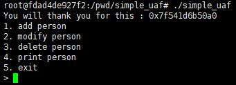

일반 UAF 문제와 같은 포맷인듯하다.

문제가 친절한 점은 도움이 될만한 주소를 먼저 leak 해준다는 것이다.

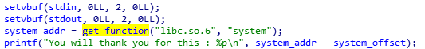

해당 주소는 libc 상의 `system` 함수 실제 주소에서 `system` 함수 오프셋을 뺀 주소로, 다시말해서 `libc_base` 주소를 나타낸다.

> 바이너리 상에서 추출해주는 주소를 보니 끝에 **개행문자(0xa0)** 가 자꾸 주소에 붙어나오는 것을 발견할 수 있었는데, 이 때문에 나중에 libc_base 주소를 받아올 때 개행문자를 떼고 0x100 을 해주어 정확한 libc_base 를 맞춰주었다.

이 `libc_base` 주소만 알면, 나중에 쉘을 실행시킬 때 **one_gadget** 을 이용하여 간편하게 쉘을 실행시킬 수 있을 것이다.

---

## UAF는 어디에서?

개인적으로 heap 문제들은 취약점이 나올만한 부분을 찾는게 너무 큰 일이다.

대부분 함수도 많고, 로직도 복잡하니...

아무튼 바이너리의 작동 구조를 간략히 설명해보겠다.

**add person** 을 선택하면, `malloc(48)` 을 통해 heap 공간을 부여받고 해당 48 바이트 안에 `setConstructor()` 와 `personConstructor()` 함수를 통해 person 구조체에 대한 정보들을 기입한다. **(`personConstructor()` 는 구조체에 삽입된 채로 실행된다.)**

이 때, name 문자열과 int 형의 age 그리고 해당 구조체를 수정하고 삭제하고 출력할 수 있는 함수들을 **함수포인터** 형식으로 넣는다.

그리고 함수들까지 삽입이 완료되면, 해당 person 구조체의 heap 주소는 전역배열인 `list` 배열에 하나씩 쌓여간다. 

모식도로 정리하면 아래와 같다.

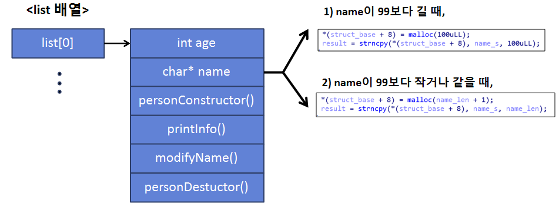

이게 person 구조체 하나의 모습이다.

여기서 눈여겨 보고가야할 것은 **name** 이 들어갈 heap 영역을 새로 할당받을 때, 길이가 99가 넘느냐 마느냐이다. 넘지않는다면, `malloc` 의 크기를 99바이트 안에서는 자유자재로 할 수 있기 때문에 중요하게 보고 넘어갔다.

그리고 바로 해당 heap 영역을 해제하는 로직을 보았다. 위 구조체의 `personDestuctor()` 함수에서 이 기능을 수행한다.

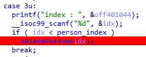

*[main함수에서 해제 돌입하는 부분]*

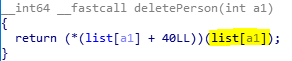

*[deletePerson함수 내부]*

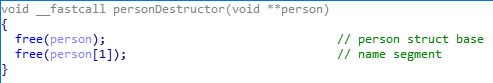

*[personDestuctor함수 내부]*

우선 처음에 `main` 함수 switch 문을 보면, **list** 에 요소가 들어가있는 idx 에 따라 해제할 곳을 선정한다.  그리고 free 를 진행하는데, 해제 과정이 뭔가 부자연스럽다고 해야할까...? 이 부분도 중요하게 보았다.

그리고 마지막으로 볼 부분은 수정을 담당하는 modifyName 이다.

main함수에서 idx에 따라 참조하는 것은 똑같고 본 함수를 눈여겨보자.

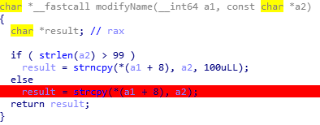

*[modifyName 함수 내부]*

다른 입력기능은 모두 strncpy 로 `bof` 혹은 `oob write` 를 방지하고있다. 그러나 이 부분은 `strcpy()` 를 통해 `char* name` 에 문자열을 덮어씌운다.

이는 충분히 공격벡터에 쓰일 수 있는 취약점이다.

그러면 여기까지 알아본 것들로 공격벡터를 조합해보자.

---

만약 `addPerson` 에서 **name** 의 길이가 47 이 되도록 하면 어떻게 될까?

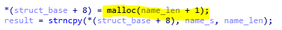

`personConstructor()` 의 이 부분을 다시 보면, 48 바이트의 heap 공간이 **name** 용으로 추가할당 되는 것으로 알 수 있다.

그러면, 최초 할당된 청크로 보면 아래와 같은 상태일 것이다.

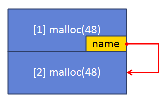

gdb 에서 확인하면 아래와 같다.

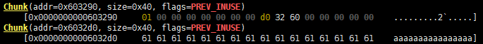
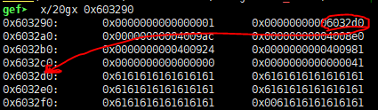

원래 위 처럼 순차적으로 할당이 되어야 정상적인 코드일 것이다.

하지만, 여기서 `free` 되는 순서를 다시돌아보자. `free` 는 앞에서 보다시피

`person 구조체 -> 해당 구조체의 name 영역`

순으로 해제가 되었다.

그러면 해제된 청크로 간주되어 어떠한 **bin** 에든지 들어갈 것이다.

해당 청크는 크기가 그리 크지않으므로 **tcache** 영역에 들어간다.

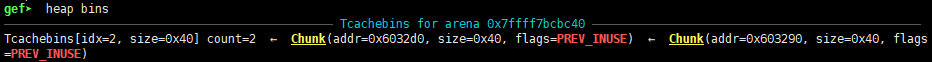

여기서 다시 `addPerson` 으로 name 길이 47 의 영역을 똑같이 할당한다면?

