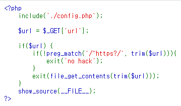
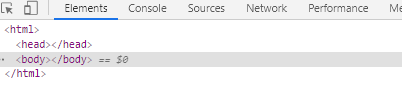

# easy_ssrf
### #ssrf #lfi

ssrf 를 이용하는 문제.

우선 문제 링크로 들어가면 해당 코드만 띄워준다.

http://13.125.66.218/index.php?url=something

이런 식으로 **url** 을 GET 방식으로 받아오는데, 어차피 "https" 값이 아니라면,
**"no hack"** 을 띄워줄 것이다.

만약, preg_match 함수의 조건이 맞아떨어진다면, url 변수는 **file_get_contents** 함수의 인자로 들어간다.

> **file_get_contents** 함수는 인자로 들어간 경로의 파일을 읽어오는 함수로 로컬환경의 **절대·상대경로** 혹은 웹페이지의 **URI/URL** 까지 들어갈 수 있다.

따로 알아낼만한 api 는 없는 것 같으니 **php wrapper** 을 이용해서 플래그를 읽어야겠다고 생각했다.

---

## 플래그가 어디있는가?

flag 파일이 따로 탐색되지않았기에 include 되어있는 config.php 파일을 열람해보기로 하였다.

일단 파일은 존재하는 것으로 확인하였고, 아무것도 보여지지않았다.

약간의 게싱을 하여, config.php 파일에 플래그에 대한 단서가 있을 것이라 생각하였고, **php wrapper** 을 이용하여 읽어보기로 하였다.

---

## PHP Wrapper

PHP Wrapper 는 간략히 말하여 본 데이터를 원활히 출력 혹은 실행이 되도록 해주는 일종의 도우미 이다.

해당 PHP Wrapper 는 여러가지가 있는데, 주로 LFI 에서 쓰이는 Wrapper 는

> php://filter

이다.

해당 PHP Wrapper 는 php 에서 다양한 입출력, 오류출력 등의 stream 을 제공하는 역할을 한다. 이 점을 이용하여 서버에 존재하는 대부분의 문서를 열람할 수 있다.

---

## 플래그 획득

