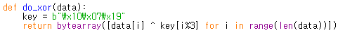

# simple_packet
### #socket #tcp #packet #forensic

파일은 총 3개가 주어진다.

- client.py  server.py
    
    두 파일은 소켓 통신을 한다. 
    

    보다시피 server.py 는 localhost:9999 에 해당 소켓을 열어놓고 client.py 의 입력을 기다린다. 
    이 때, client.py 에서 온 data 는 **do_xor()** 함수를 통과하여 온다.
    
    그리고 **do_xor()** 함수의 결과가 `Hell, World` 와 같다면, flag 를 보여주는 **win()** 함수를 실행한다.

    **do_xor()** 함수는 server.py 와 client.py 에서 똑같은 형태인데, 통신과정에서 출제자가 커스텀으로 만든 인코딩 함수이다.

    함수형태는 아래와 같다.
    

    `"\x10\x07\x19"` 를 key로 하여 함수의 인자로 들어온 문자열과 순차적으로 `xor` 연산을 한다.

    

    **win()** 함수는 다음과 같다. 큰 기능은 없다.

    client.py 는 간략히 설명하겠다. 실행할 때, 서버주소와 포트를 기입하면 해당 주소로 데이터를 쏠 수 있다.

- simple_packet.pcapng

    이 파일은 client.py 와 server.py 사이의 통신기록을 모아놓은 패킷 캡쳐 파일이다.

    tcp protocol 의 9999 포트를 필터링해서 뒤적거리면 유용한 정보가 나올 것 같다.

----

## 풀어보자

우선 최종 목표는 플래그를 볼 수 있는 **win()** 함수를 실행시키는 것이니, `client -> server` 로 보낸 데이터가 `Hell, World` 를 **do_xor()** 한 결과 값이어야 할 것이다.

해당 데이터부터 알아보자. 방법은 **do_xor()** 함수에 `Hell, World` 만 넣고 산출 값을 확인해보면 된다.

산출 값을 확인해보니 `Xbu|+9Ghk|c` 가 나왔다. 아마, 패킷캡처 파일에 해당 데이터를 주고받은 결과가 있을 것이라 게싱하였다.

와이어샤크에서 해당 필터링을 주고, 패킷들을 뒤져보았다.

id 273 번째 패킷에 찾았던 데이터와 동일한 data 전송기록이 남았다.

**(참고로 `192.168.1.101` 이 클라이언트고, `13.124.187.230` 이 서버이다.)**

그리고 id 337 패킷을 보면, id 273 바로 직후에 위와 같이 서버에서 클라이언트로 다시 flag 에 대한 데이터를 전송하는 패킷이 있다.

해당 데이터를 hex 값 그대로 가져와서 **do_xor()** 함수에 돌려보았다.

플래그가 나온다.

.

.

.

**Contact : a42873410@gmail.com**

