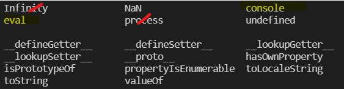
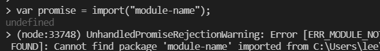
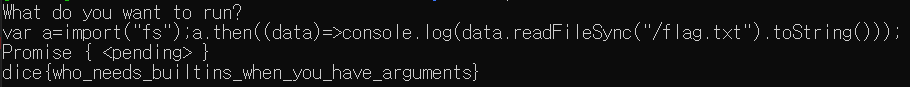

# undefined
## #nodejs #jail

---

node.js 를 활용한 jail 문제이다.

```javascript
#!/usr/local/bin/node
// index.js
// don't mind the ugly hack to read input
console.log("What do you want to run?");
let inpBuf = Buffer.alloc(2048);
const input = inpBuf.slice(0, require("fs").readSync(0, inpBuf)).toString("utf8");
inpBuf = undefined;

Function.prototype.constructor = undefined;
(async () => { }).constructor.prototype.constructor = undefined;
(function* () { }).constructor.prototype.constructor = undefined;
(async function* () { }).constructor.prototype.constructor = undefined;

for (const key of Object.getOwnPropertyNames(global)) {
    if (["global", "console", "eval"].includes(key)) {
        continue;
    }
    global[key] = undefined;
    delete global[key];
}

delete global.global;//global 삭제
process = undefined;//process 삭제

{
    let require = undefined;
    // ...
    // many built-in functions are undefineded
    // ...
    console.log(eval(input));
}
```

문제의 소스이다.

보면, 우선 `Function`, `AsyncFunction`, `Generator Function`, `AsyncGenerator` 객체 날리고 `global`, `process` 변수 날리고 마지막으로 node.js 실행과 동시에 생기는 **built-in 함수** 들까지 모두 날린다.

그렇게 되면 남는(사용가능한) 것은 아래와 같은 것들이다.



사실상 쓸 수 있는게 `eval` 이랑 `console` 객체정도라고 보면 될듯하다.

좀 한참 헤맨게 어차피 파일을 읽으려면, `fs` file system 모듈을 통해서 text 파일을 읽어와야할텐데 당최 require 를 쓸 수 있는 방안이 없으니 혹시 다른 객체 타고타고도 가보고, import 구문 또한 써보았지만, `package.json` 에 설정이 안되어있는지 그냥 import 는 성공하지 못했었다.

아마 fs 안쓰고 푸는 풀이가 있는지는 잘 모르겠다. 내가 미약한 실력이라 그런 것일 수도..?

그런데 한숨 자고 나서 초심으로 돌아가보자 하고 `import` 구문에 대한 [docs](https://developer.mozilla.org/ko/docs/Web/JavaScript/Reference/Statements/import) 를 찾아보았다.

아니 근데 잘 사용하지 않은 용례가 하나 존재했었다!!

```javascript
var promise = import("module-name");
```

import 를 키워드 처럼 사용하지않고 함수 형태로 사용해서 promise 객체를 반환받는 형태이다.

그리고...



이게 성공했다. ㅋㅋㅋㅋ module-name 대신 **fs 모듈** 을 가져오면 된다.

마지막은 payload!

```javascript
var a=import("fs");a.then((data)=>console.log(data.readFileSync("/flag.txt").toString()));
```

### result



.  
.  
.  


**Contact : a42873410@gmail.com**

