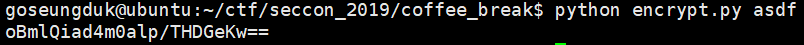
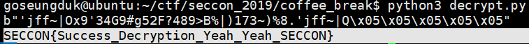

# COFFEE_BREAK
### #crypto #reversing

간단히 풀 수 있었던 크립토(?) 라기엔 리버싱에 가까운 문제였다.

```
The program "encrypt.py" gets one string argument and outputs ciphertext.

Example:

$ python encrypt.py "test_text"
gYYpbhlXwuM59PtV1qctnQ==
The following text is ciphertext with "encrypt.py".

FyRyZNBO2MG6ncd3hEkC/yeYKUseI/CxYoZiIeV2fe/Jmtwx+WbWmU1gtMX9m905
```
문제 설명은 맨 아래의 어떤 문자열은 encrypt.py 에 의해 암호화 되었으니 복호화 하라는 것 같다.  

---

```python
#encrypt.py

import sys
from Crypto.Cipher import AES
import base64


def encrypt(key, text):
    s = ''
    for i in range(len(text)):
        s += chr( ( ((ord(text[i]) - 0x20) + (ord(key[i % len(key)]) - 0x20)) % (0x7e - 0x20 + 1)) + 0x20)
    return s 

key1 = "SECCON"
key2 = "seccon2019"
text = sys.argv[1]

enc1 = encrypt(key1, text)
key=key2 + chr(0x00) * (16 - (len(key2) % 16))
cipher = AES.new(key, AES.MODE_ECB)
# where is iv?
p = 16 - (len(enc1) % 16)
enc2 = cipher.encrypt(enc1 + chr(p) * p)
print(base64.b64encode(enc2).decode('ascii'))

```

처음에 encrypt.py 라는 파일을 하나 준다.



실행시켜보니 인자로 어떤 문자열을 주면 소스의 암호화 과정을 거친 결과를
출력시켜준다.

소스의 순서는 이렇다.

```
제작자의 임의의 암호화 -> 변수 p를 이용한 AES 암호화 -> base64인코딩
```

그러면 base64와 AES는 거꾸로 복호화만 해주면 되고, 우리가 그나마 눈여겨 봐야할 것은 제작자가 임의로 만든 암호화 함수이다.

이 또한 결국엔 거꾸로 역연산 하면 된다.

```python
# decrypt.py

import sys
from Crypto.Cipher import AES
import base64
prob='FyRyZNBO2MG6ncd3hEkC/yeYKUseI/CxYoZiIeV2fe/Jmtwx+WbWmU1gtMX9m905'
key1="SECCON"
key2="seccon2019"
key=key2+chr(0x00)*(16-(len(key2)%16))
cipher=AES.new(key,AES.MODE_ECB)

enc2=base64.b64decode(prob.encode('cp949'))
# to unicode
before_enc2=cipher.decrypt(enc2)
print(before_enc2)
# this is equal to enc1+chr(p)*p
# p=0x05
#print("________ we get 'p' = 0x05 ________")
enc1="'jff~|Ox9'34G9#g52F?489>B%|)173~)%8.'jff~|Q"
#print(enc1)
flag=''
for i in range(len(enc1)):
        tmp=chr((((ord(enc1[i])-0x20)+(0x7e-0x20+1))-(ord(key1[i%6])-0x20))+0x20)
        if(ord(tmp)>127):
                flag+=chr(ord(tmp)-95)
        else:
                flag+=tmp
print(flag)
```

---
아래는 결과이다.



.  
.  
.  


**Contact : a42873410@gmail.com**