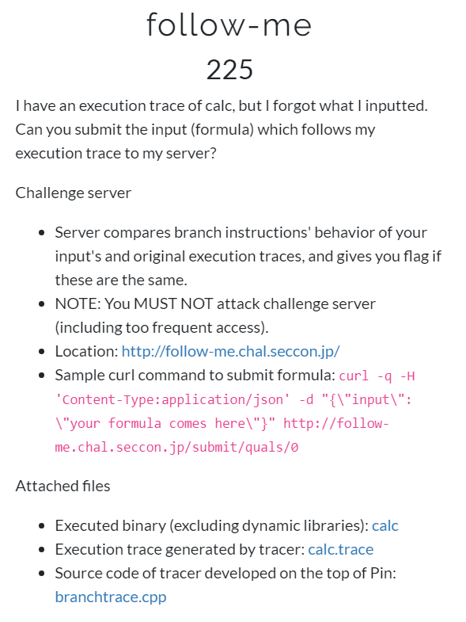
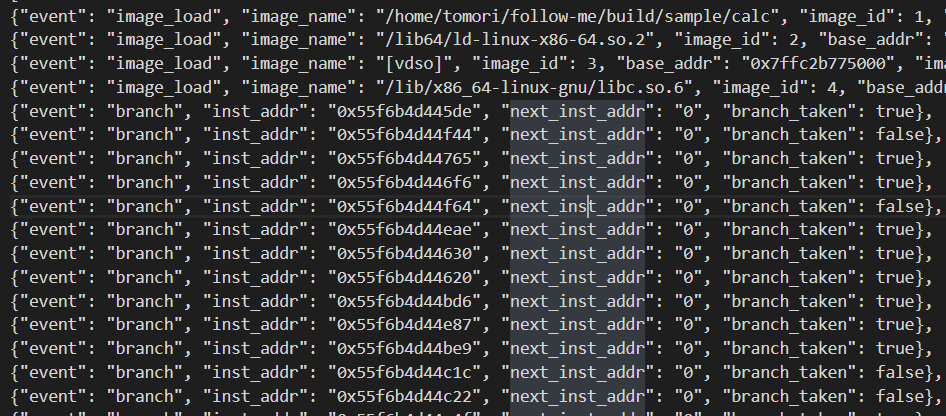

# follow_me
### #reversing

---


---

우리의 숙제는 계산기 프로그램에서 실행했던 기록 중에서도 branch 명령에 대한 기록을 보고, 어떤 공식을 프로그램에 전달했는지 찾는 것이다.

파일은 총 3개, 계산기 프로그램 바이너리와 branch명령에 대한 기록, 그리고 branch명령을 따라가는 추적프로그램에 대한 소스코드를 준다.

필자는 앞의 계산기 프로그램 바이너리와 branch 명령에 대한 기록만 보고 문제를 풀었다.

---


main 함수이다. 바이너리의 사용법과 실제로 계산을 해주는 함수가 들어있다.


calculate 함수의 switch문 부분이다.

이 바이너리에서 다루는 연산자는 +, -, *, m, M 인 것으로 유추된다.


그리고 이 부분에 의해 숫자를 입력하면 입력한 숫자마다 차곡차곡 힙 메모리에 쌓인다.

아무튼 사전작업은 이정도이다.

calculate 함수를 분석하면서 어떤식으로 바이너리가 동작하는지 살펴보자.

#### 한 가지 빼먹은 것이 있는데 ,(콤마) 문자를 입력하면 각 연산자 및 숫자를 구분할 수 있다. 이것도 아래에서 살펴보자.

---


우선, 각 숫자들은 입력한 순서대로 바이너리에서 지정한 스택에 차곡차곡 쌓인다.

그리고 연산자는 가운데에 쓰이는 중위연산이 아닌 후위연산으로 진행된다.

+, -, * 의 의미는 원래의 수학기호와 같고, m은 두 숫자 중 작은 것을 택하는 연산자, M은 두 숫자 중 큰 것을 택하는 연산자이다.


> calc.trace 파일

calc.trace 파일에는 바이너리에서 거쳐간 모든 branch 명령어의 주소가 들어가있다. 그리고 그 부분에서 branch 를 했으면 true, 아니면 false로 표기해놓았다.

calc.trace의 개수가 많았다면 툴을 짜려고했으나, 생각보다 금방 분석할 것 같아서 수동으로 분석하였다.

---

우선 trace 기록을 행동 단위로 쪼개서 볼 수 있다.  
분석에는 IDA 7.0과 Ghidra를 같이 사용하였다.

### 숫자를 받아오는 부분


이 부분은 숫자하나를 받아오는 부분이다.

### ,(콤마) 를 받아오는 부분


이 부분은 ,(콤마) 하나를 받아오는 부분이다.

### + 를 받아오는 부분


이 부분은 + 연산자 하나를 받아오고 계산하는 부분이다.

다만 이제 주의할 점이 있다. 0xa1f 로 끝나는 주소부분이 + 연산자를 만날 때 마다 유동적으로 반복되는데, IDA로 자세히 보자.


무언가 소스가 나왔으나 뭔가 간단한 로직이 복잡하게 나온 것 같아서 Ghidra로 다시 확인해보기로 했다.


혹시나 했지만, 역시나였다.   

단순히 그냥 두 번째 인자의 수를 10으로 나눈 후, 10을 곱해서 첫 번째 인자에 더한 다음, 두 번째 인자의 첫 자리 수 만큼 반복문을 돌아서 두 수의 합을 구하는 로직이다.

아마 0xa1f 로 끝나는 branch 명령주소는 저 반복문이 분기하는 주소일 것이다.

이를 토대로 어떤 형태의 수가 인자로 들어가야하는지 파악할 수 있다.

### * 를 받아오는 부분


 곱하는 * 는 소스를 통틀어서 단 한번, 마지막 부분 밖에 나오지않는다.

 여기서도 주의해서 봐야할 부분이 있는데, 0xa81 부분이다.

 이 부분도 Ghidra로 확인해야 깔끔하게 나온다.

 

 중요한 부분은 + 에서 사용했던 덧셈 함수가 쓰인다는 점이다.

 그래서 *의 branch 명령 기록에 0xa1f 로 끝나는 부분이 몇 번 나온 것이다.

 그리고 0xa81로 끝나는 부분은 위의 곱셈함수의 반복문에 대한 것인데,
 
 두 번째 인자의 수만큼 반복하는게 특징이다.  

 하지만, 단 한번 밖에 나오지 않는다. 고로 곱할 때 두번 째 인자로 1이 들어간다는 것을 알 수 있다.

 ### - 를 받아오는 부분

 

 이 부분은 그냥 뺄셈을 하는 과정이다. 별다른 특이사항은 없다.

 ---

 이제 branch 기록이 어떻게 형성되어있는지 보았으니 각 연산자 branch 기록의 반복을 따라가면 최종적으로 이런 형태의 식이 나온다.   
 > 임의의 숫자는 1로 처리하였음.

 ` 111,111,111,111,111,1111,111,mm-mM-111,111,111,mm-111,111,111,111,111,-+-M+111,111,111,mm* `

 


일단은 정답은 아니다.

이제 식에 대한 구조를 구했으니 정확히 어떤 수가 들어갈지 파악해야한다.

이 부분은 위의 연산자 설명에서 말한 +와 * 연산의 특징만 잘 파악하면 어떤 숫자가 들어갈지 파악할 수 있다. 뺄셈은 제외하고 덧셈과 곱셈만 설명하겠다.

위의 식을 뒤에서 부터 분석해보면,

곱셈연산을 하는데 branch 기록에서는 0xa81 branch가 단 한번 나왔으므로, 뒤의 인자가 1이어야한다.  
그러면 결론적으로 곱셈을 하기전에 우선적으로 mm에 대한 결과가 1이어야한다.

따라서 ` 111,111,111,mm* ` 는 ` 001,002,003,mm* ` 으로 쓸 수 있겠다. 또한 곱셈 안에서도 덧셈을 6번을 하기에, 첫 번째 인자는 ` xx6 ` 형태의 자연수가 될 것이다.

그리고 ` 111,111,111,111,111,-+-M+ ` 여기서 첫 번째 덧셈은 맨 마지막에 입력한 두 수를 뺀 것을 더하는데 0xa1f branch가 3번 반복하므로 두 수를 뺀 것은 ` xx3 ` 형태의 자연수가 될 것이다.   

그리고 마지막 덧셈은 0xa1f branch가 8번 반복하므로 M에 의해 나온 수는 ` xx8 ` 형태의 자연수가 될 것이다.

이를 고려하여 적합한 수를 입력하여 ` curl ` 명령을 보내주면 플래그를 얻을 수 있다.

### formula

` 999,000,000,000,000,0000,000,mm-mM-931,932,933,mm-438,400,111,246,123,-+-M+001,002,003,mm* `  

* 공식에 대한 설명을 덧붙이려고 한다.  
```
0000m000 => 000  
000m000 => 000  
000-000 => 000  
000m000 => 000  
000M000 => 000  
999-000 => 999  
932m933 => 932  
931m932 => 931  
999-931 => 68  
246-123 => 123  
111+123 => 234 (0xa1f is repeated 3 times)  
400-234 => 166  
438M166 => 438  
68+438 => 506  (0xa1f is repeated 8 times)  
002m003 => 002  
001m002 => 001  
506*001 => 506  (0xa1f is repeated 6 times and 0xa81 is repeated 1 times)
``` 

### flag 


.  
.  
.  


**Contact : a42873410@gmail.com**
