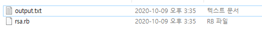
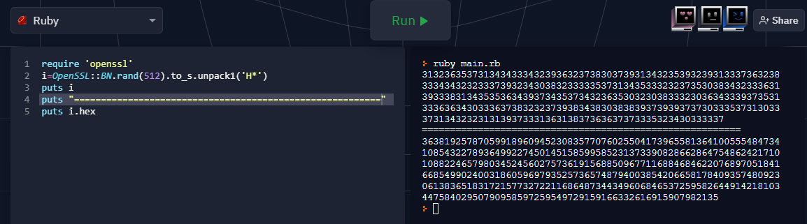
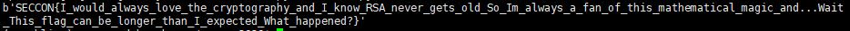

# this_is_rsa
### #rsa #crypto
---

RSA 암호 기법이 적용된 문제이다.

파일은 아래와 같이 총 2개 이다.




**output.txt** 파일은 **rsa.rb** 파일로 어떠한 값을 rsa 암호화 시킨 결과 값인 c 와 그 과정에서 사용되는 공개키 n 의 값이다.

원래 rsa 원리 상, n 과 c 값 만으로는 c 값을 복호화 시킬 수 없는게 맞다.

그러면 **rsa.rb** 파일에서 rsa 암호화 과정을 진행하는 부분에서 어떠한 취약점 혹은 오류가 있는지 찾아보아야 한다.

```ruby
# rsa.rb

require 'openssl'

def get_prime
  i = OpenSSL::BN.rand(512).to_s.unpack1('H*').hex
  OpenSSL::BN.new(i).prime? ? i : get_prime
end

p = get_prime
q = get_prime
n = p * q
e = 65537
m = File.read('flag.txt').unpack1('H*').hex
c = m.pow(e, n)

puts "N = #{n}"
puts "c = #{c}"
```

**rsa.rb** 파일의 코드이다.

나머지는 간단한 연산과 출력문이므로 `get_prime` 함수만 분석하면 될 것 같다.

일단 코드를 실행해서 직관적으로 이해해보기로 하였다.



보다시피, `rand(512)` 로 만들어진 512비트 정수를 **string** 형태롤 만들어 해당 문자열의 hex 값을 `unpack1('H*')` 문으로 가져오는 것을 알 수 있다.

여기서 이 부분이 왜 취약점이 될 수 있는지 이해를 못했는데, 아래의 링크 영상의 설명을 통해 이해할 수 있었다.

[SECCON 2020 Online CTF writeup - YouTube](https://www.youtube.com/watch?v=VUea1wDQe_A)

필자가 이해한 것대로 설명을 하면, 어차피 **p** 와 **q** 값은 **0x30 ~ 0x39** 의 숫자의 아스키코드 값 안에서 생성이 되는데, 이렇게 되면 브루트포싱을 할 경우의 수가 확 줄어들게 된다.

만약, `0x~~~~~~cee9` 라는 `0xe9` 로 끝나는 hex 값이 있다면, 끝자리가 9로 끝난다는 것을 토대로 `p=0x~~~33 , q=0~~~x33` 혹은 `p=0x~~~31 , q=0~~~x39` 라고 추측을 할 수 있다. 

또한, 해당 아스키코드 범위라고 한정을 하면 hex 값이 2자리 단위로 하나의 문자를 나타낼 것이기에 hex 한 자리씩 브루트포싱을 때리지 않아도 되어 경우의 수가 줄어든다.

| **ex)** "123" 은 hex로 0x313233 으로, 0x33, 0x3200, 0x310000 으로 두 자리씩 브루트 포싱을 할 수 있다.


```python
# brute forcing for p & q

target = 13234306273608973531555502334446720401597326792644624514228362685813698571322410829494757436628326246629203126562441757712029708148508660279739210512110734001019285095467352938553972438629039005820507697493315650840705745518918873979766056584458077636454673830866061550714002346318865318536544606580475852690351622415519854730947773248376978689711597597169469401661488756669849772658771813742926651925442468141895198767553183304485662688033274567173210826233405235701905642383704395846192587563843422713499468379304400363773291993404144432403315463931374682824546730098380872658106314368520370995385913965019067624762624652495458399359096083188938802975032297056646831904294336374652136926975731836556951432035301855715375295216481079863945383657
# value of N

p = 0
q = 0
cnt = 0

while True:
    mask=(1<<(cnt+1)*8)-1
    # mask => 0xff, 0xffff, 0xffffff, ...
    okcnt=0
    for i in list(range(10)) +[0x30]:
        num1=(i^0x30)<<(cnt*8)
        num1+=p
        for j in list(range(10)) + [0x30]:
            num2=(j^0x30)<<(cnt*8)
            num2+=q
            if((num1*num2)&mask ==target&mask):
                # bit masked (p*q) and N
                okcnt+=1
                p=num1
                q=num2
        if(okcnt==1):
            break

    if(target&mask==target):
        break
    cnt+=1

assert(p*q==target)
print("p = "+hex(p)) # result of p
print("q = "+hex(q)) # result of q
```

위 브루트 포싱 코드를 돌리면, 아래와 같은 p 와 q 값이 도출된다.

```
p = 0x3130333437373932343938303431393734313132323330363538363337323632363938323630363235393536323630373630383633343031363337393130343139383130333237333834303934323138303135383337343431313937313734353032323634323238333535373938323934363433303335393836353434373639353736323433373135353335383033393935323130383132363431
q = 0x3132303432373230323036383034393936343037323234343239353234323235333035323636313737393335393232343834323735323634323634353237323636373737383134383131373438323131353037343636383536383830363430353530373136393336303936353434343635383236393931313436333939353536303434383135333236323339393031323536343534313933343039
```

**c** 값을 복호화 해보면 플래그가 나온다.

```python
dec.py

from Crypto.Util.number import *
p=0x3130333437373932343938303431393734313132323330363538363337323632363938323630363235393536323630373630383633343031363337393130343139383130333237333834303934323138303135383337343431313937313734353032323634323238333535373938323934363433303335393836353434373639353736323433373135353335383033393935323130383132363431
q=0x3132303432373230323036383034393936343037323234343239353234323235333035323636313737393335393232343834323735323634323634353237323636373737383134383131373438323131353037343636383536383830363430353530373136393336303936353434343635383236393931313436333939353536303434383135333236323339393031323536343534313933343039

n=p*q
phi=(p-1)*(q-1)
e=65537
#d=pow(e,-1,phi)
d=inverse(e,phi)
c=9094564357254217771457579638296343398667095069849711922513911147179424647045593821415928967849073271368133854458732106409023539482401316282328817488781771665657515880026432487444729168909088425021111879152492812216384426360971681055941907554538267523250780508925995498013624610554177330113234686073838491261974164065812534037687990653834520243512128393881497418722817552604416319729143988970277812550536939775865310487081108925130229024749287074763499871216498398695877450736179371920963283041212502898938555288461797406895266037211533065670904218278235604002573401193114111627382958428536968266964975362791704067660270952933411608299947663325963289383426020609754934510085150774508301734516652467839087341415815719569669955613063226205647580528

print(long_to_bytes(pow(c,d,n)))
```



.

.

.

**Contact :** a42873410@gmail.com