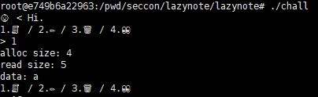
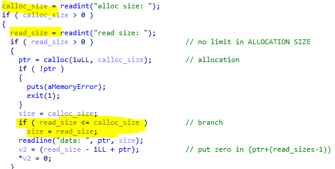
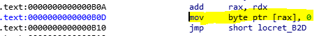
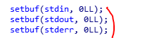
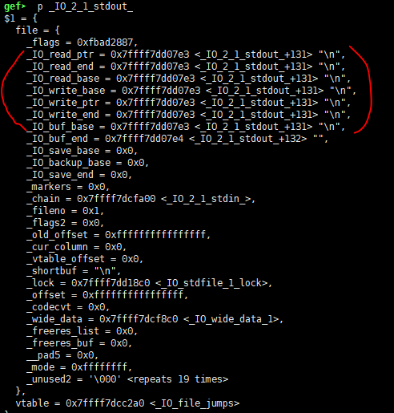
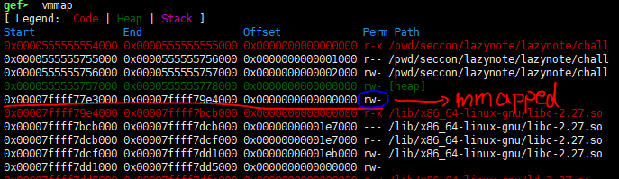
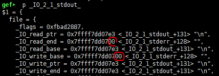
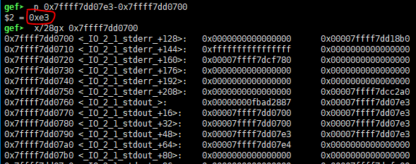

# lazynote
### #FSOP #pwnable 

---

FSOP(File Stream Oriented Programming) 관련한 문제를 풀어보았다.

해당 기법은 바이너리 내에 stdin, stdout, stderr 등 **_IO_FILE** 구조체를 사용하는 fgets, puts 함수 등이 있는 경우에 사용할 수 있다.

또한 이를 통해 해당 구조체의 **vtable** 을 조작하여 system 함수나 여타 쉘을 켤 수 있는 다른 함수를 overwrite 시켜야한다.

그러면, 결론적으로 fgets 나 puts 를 실행했을 때 overwriting 한 함수로 jump 되도록 exploit 을 할 수 있다.


# **Preview**



바이너리는 이런 식으로 작동된다. 선택할 수 있는 메뉴는 1 밖에 없다.



1 번 메뉴에 대한 로직이다.

해당 함수를 보면 readline 하는 size 에 대한 검사는 있지만, read_size 에 대한 사이즈 체크가 없다.

결론 적으로 할당한 **ptr** 에 (read_size-1) offset 만큼 이동한 어느 영역이던지 
` *v2=0 ` 으로 0 을 덮어 씌울 수 있는 것이다.



**덮어씌우는 크기에 주의하자!!** 8바이트 모두 덮는 것이 아닌, 해당 주소의 마지막 LSB 1바이트만 덮는 것이다.

FSOP 기법을 자주 본적은 없기에 이러한 취약점으로 exploit 이 된다는게 상상이 안되었다. (참으로 신기하다.)

그전에, main 함수에서 보고 가야할 부분이 있다.



위와 같이 setbuf 함수로 각 표준입출력, 에러를 **unbuffered** 상태로 만든다.



해당 사진이 바로 그 결과이다. 

[_IO_FILE](https://code.woboq.org/userspace/glibc/libio/bits/types/struct_FILE.h.html#_IO_FILE) 구조체의 모습이다. 해당 stdout 은 파일 출력 등에 관여하는 요소들의 값이 동일하도록 초기화 되어있다. 

일단 이정도로 알아두자.

---

# **Allocation**

우선 calloc 함수가 libc 영역 부근에 heap 을 형성할 수 있도록 해주어야한다.

이를 위해서는 calloc 내부적으로 실행되는 malloc 이 아닌, malloc 내부에서도 `mmap` 함수가 실행되도록 해야한다.

malloc 은 `mmap_threshold` 라는 크기 기준을 두어서 해당 값보다 큰 사이즈를 할당하려고 하면 mmap syscall 을 통해 data 영역(정확히는 bss 영역?)을 사이즈만큼 떼어 heap으로 준다.

`mmap_threshold` 사이즈는 정확히 코드 상으로는 아래와 같다.

```c
// glibc/malloc/malloc.c

/*
  MMAP_THRESHOLD_MAX and _MIN are the bounds on the dynamically
  adjusted MMAP_THRESHOLD.
*/
#ifndef DEFAULT_MMAP_THRESHOLD_MIN
#define DEFAULT_MMAP_THRESHOLD_MIN (128 * 1024)
#endif
#ifndef DEFAULT_MMAP_THRESHOLD_MAX
  /* For 32-bit platforms we cannot increase the maximum mmap
     threshold much because it is also the minimum value for the
     maximum heap size and its alignment.  Going above 512k (i.e., 1M
     for new heaps) wastes too much address space.  */
# if __WORDSIZE == 32
#  define DEFAULT_MMAP_THRESHOLD_MAX (512 * 1024)
# else
#  define DEFAULT_MMAP_THRESHOLD_MAX (4 * 1024 * 1024 * sizeof(long))
# endif
```

주석과 같이 **MMAP_THRESHOLD** 는 **DEFAULT_MMAP_THRESHOLD_MIN** 과 **DEFAULT_MMAP_THRESHOLD_MAX** 사이에서 유동적으로 결정되는 듯 하다.

```c
// glibc/malloc/malloc.c 

static void *
sysmalloc (INTERNAL_SIZE_T nb, mstate av){
    ...
    ...
 if (av == NULL
      || ((unsigned long) (nb) >= (unsigned long) (mp_.mmap_threshold)
          && (mp_.n_mmaps < mp_.n_mmaps_max)))
    {
      char *mm;           /* return value from mmap call*/
    try_mmap:
      /*
         Round up size to nearest page.  For mmapped chunks, the overhead
         is one SIZE_SZ unit larger than for normal chunks, because there
         is no following chunk whose prev_size field could be used.
         See the front_misalign handling below, for glibc there is no
         need for further alignments unless we have have high alignment.
       */
      if (MALLOC_ALIGNMENT == 2 * SIZE_SZ)
        size = ALIGN_UP (nb + SIZE_SZ, pagesize);
      else
        size = ALIGN_UP (nb + SIZE_SZ + MALLOC_ALIGN_MASK, pagesize);
      tried_mmap = true;
      /* Don't try if size wraps around 0 */
      if ((unsigned long) (size) > (unsigned long) (nb))
        {
          mm = (char *) (MMAP (0, size, PROT_READ | PROT_WRITE, 0));
          ...
          ...
          ...
```

그리고 위와 같이 `mp_.mmap_threshold` 값을 비교하여 할당해주어야하는 **nb** 값이 더 크면 `MMAP` 함수가 실행되는 if 문으로 분기한다.

아래는 `ALIGN_UP` 매크로 구문이다. 인자로 들어오는 size 를 기준으로 올림해주는 함수이다.

```c
// glibc/include/libc-pointer-arith.h

/* Align a value by rounding down to closest size.
   e.g. Using size of 4096, we get this behavior:
        {4095, 4096, 4097} = {0, 4096, 4096}.  */
#define ALIGN_DOWN(base, size)        ((base) & -((__typeof__ (base)) (size)))
/* Align a value by rounding up to closest size.
   e.g. Using size of 4096, we get this behavior:
        {4095, 4096, 4097} = {4096, 4096, 8192}.
  Note: The size argument has side effects (expanded multiple times).  */
#define ALIGN_UP(base, size)        ALIGN_DOWN ((base) + (size) - 1, (size))

```
```c
// include/asm-generic/param.h

#ifndef EXEC_PAGESIZE
#define EXEC_PAGESIZE	4096
#endif
```

**pagesize** 는 4096 으로, [_rtld_global_ro 테이블](https://code.woboq.org/userspace/glibc/elf/rtld.c.html#rtld_global_ro) 에서 가져온다.

그렇게 되면 만약 0x200000 을 할당크기로 넣었을 시에, 추가적인 헤더 chunk 등을 포함하여 0x400000 으로 최종 size 가 정해질 것이다.

일단 이런식으로 하면 `MMAP` 함수가 아래와 같이 heap 을 할당해준다.


*[0x200000 만큼 calloc 한 결과]*

> 여기서 의문점이 드는게 있는데 0x200000 이상의 크기로 할당하면 libc 메모리 전반부에 heap 이 할당되는데 그보다 조금 아래 크기로 할당하면 libc 메모리 후반부에 할당이 된다. 왜 그런지는 아직 못밝혀냈다... **(아시는 분은 읽고 메일 부탁드립니다...)**

아무튼 이렇게 첫 번째 준비는 끝났다.

---

# **LEAKING LIBC ADDRESS**

일단은 libc 주소를 뽑아내보자. 일단은 무작정 뽑을 순 없고, **FSOP 기법** 이 사용되었으니 출력에 관련된 `puts` 함수를 뒤적거려보자.

```c
// glibc/libio/ioputs.c

int
_IO_puts (const char *str)
{
  int result = EOF;
  size_t len = strlen (str);
  _IO_acquire_lock (stdout);
  if ((_IO_vtable_offset (stdout) != 0
       || _IO_fwide (stdout, -1) == -1)
      && _IO_sputn (stdout, str, len) == len
      && _IO_putc_unlocked ('\n', stdout) != EOF)
    result = MIN (INT_MAX, len + 1);
  _IO_release_lock (stdout);
  return result;
}
weak_alias (_IO_puts, puts)
libc_hidden_def (_IO_puts)
```

여기서 눈여겨 볼 것은 `_IO_sputn` 함수이다. 여기서 glibc 의 **vtable** 을 이용한 함수 호출을 볼 수 있다.

```c
// glibc/libio/libioP.h:374

#define _IO_sputn(__fp, __s, __n) _IO_XSPUTN (__fp, __s, __n)
```

`_IO_sputn` 함수는 다음과 같이 `_IO_XSPUTN` 함수를 호출하도록 되어있다.

```c
// glibc/libio/libioP.h:171

#define _IO_XSPUTN(FP, DATA, N) JUMP2 (__xsputn, FP, DATA, N)
```
그리고 `_IO_XSPUTN` 함수는 `__xsputn` 이라는 이름이 할당된 함수를 vtable 에서 찾은 후, 해당 함수로 JUMP 하도록 되어있다.

```c
// glibc/libio/libioP.h:94 ~ 

/* Essentially ((TYPE *) THIS)->MEMBER, but avoiding the aliasing
   violation in case THIS has a different pointer type.  */
#define _IO_CAST_FIELD_ACCESS(THIS, TYPE, MEMBER) \
  (*(_IO_MEMBER_TYPE (TYPE, MEMBER) *)(((char *) (THIS)) \
                                       + offsetof(TYPE, MEMBER)))
#define _IO_JUMPS(THIS) (THIS)->vtable
#define _IO_JUMPS_FILE_plus(THIS) \
  _IO_CAST_FIELD_ACCESS ((THIS), struct _IO_FILE_plus, vtable)
  ...
  ...
  ...
/* vtable 을 이용한 JUMP 구문 */
# define _IO_JUMPS_FUNC(THIS) (IO_validate_vtable (_IO_JUMPS_FILE_plus (THIS)))
# define _IO_vtable_offset(THIS) 0
#endif
#define _IO_WIDE_JUMPS_FUNC(THIS) _IO_WIDE_JUMPS(THIS)
#define JUMP_FIELD(TYPE, NAME) TYPE NAME
#define JUMP0(FUNC, THIS) (_IO_JUMPS_FUNC(THIS)->FUNC) (THIS)
#define JUMP1(FUNC, THIS, X1) (_IO_JUMPS_FUNC(THIS)->FUNC) (THIS, X1)
#define JUMP2(FUNC, THIS, X1, X2) (_IO_JUMPS_FUNC(THIS)->FUNC) (THIS, X1, X2)
#define JUMP3(FUNC, THIS, X1,X2,X3) (_IO_JUMPS_FUNC(THIS)->FUNC) (THIS, X1,X2, X3)
#define JUMP_INIT(NAME, VALUE) VALUE
...
```
그리고 `JUMP2` 함수는 위와 같다.

그리고 JUMP 를 하는 해당 vtable 의 형식인 `_IO_jump_t` 구조체를 보자.

```c
// glibc/libio/libioP.h:288

struct _IO_jump_t
{
    JUMP_FIELD(size_t, __dummy);
    JUMP_FIELD(size_t, __dummy2);
    JUMP_FIELD(_IO_finish_t, __finish);
    JUMP_FIELD(_IO_overflow_t, __overflow);
    JUMP_FIELD(_IO_underflow_t, __underflow);
    JUMP_FIELD(_IO_underflow_t, __uflow);
    JUMP_FIELD(_IO_pbackfail_t, __pbackfail);
    /* showmany */
    JUMP_FIELD(_IO_xsputn_t, __xsputn);
    JUMP_FIELD(_IO_xsgetn_t, __xsgetn);
    JUMP_FIELD(_IO_seekoff_t, __seekoff);
    JUMP_FIELD(_IO_seekpos_t, __seekpos);
    JUMP_FIELD(_IO_setbuf_t, __setbuf);
    JUMP_FIELD(_IO_sync_t, __sync);
    JUMP_FIELD(_IO_doallocate_t, __doallocate);
    JUMP_FIELD(_IO_read_t, __read);
    JUMP_FIELD(_IO_write_t, __write);
    JUMP_FIELD(_IO_seek_t, __seek);
    JUMP_FIELD(_IO_close_t, __close);
    JUMP_FIELD(_IO_stat_t, __stat);
    JUMP_FIELD(_IO_showmanyc_t, __showmanyc);
    JUMP_FIELD(_IO_imbue_t, __imbue);
};
```
간단히 요약하자면, 위의 구조체는 JUMP_FIELD 를 설정하는데 첫 번째 인자로 각 함수 자리에 맞는 TYPE 을 설정해주고, 두 번째 인자가 해당 table 자리에 와야하는 함수이름이다.

>각 TYPE 은 각각 인자 개수와, 인자의 종류 등이 다르다는 점을 알아두자!!!

```c
// glibc/libio/iopopen.c:292

static const struct _IO_jump_t _IO_proc_jumps libio_vtable = {
  JUMP_INIT_DUMMY,
  JUMP_INIT(finish, _IO_new_file_finish),
  JUMP_INIT(overflow, _IO_new_file_overflow),
  JUMP_INIT(underflow, _IO_new_file_underflow),
  JUMP_INIT(uflow, _IO_default_uflow),
  JUMP_INIT(pbackfail, _IO_default_pbackfail),
  JUMP_INIT(xsputn, _IO_new_file_xsputn),
  JUMP_INIT(xsgetn, _IO_default_xsgetn),
  JUMP_INIT(seekoff, _IO_new_file_seekoff),
  JUMP_INIT(seekpos, _IO_default_seekpos),
  JUMP_INIT(setbuf, _IO_new_file_setbuf),
  JUMP_INIT(sync, _IO_new_file_sync),
  JUMP_INIT(doallocate, _IO_file_doallocate),
  JUMP_INIT(read, _IO_file_read),
  JUMP_INIT(write, _IO_new_file_write),
  JUMP_INIT(seek, _IO_file_seek),
  JUMP_INIT(close, _IO_new_proc_close),
  JUMP_INIT(stat, _IO_file_stat),
  JUMP_INIT(showmanyc, _IO_default_showmanyc),
  JUMP_INIT(imbue, _IO_default_imbue)
};
```
그리고 설명한 해당 구조체로 만들어진 `libio_vtable` 이다. 

앞서 설명한 `__xsputn` 이라는 이름이 배정된 실제 함수는 `_IO_new_file_xsputn` 이 되겠다.

이런 vtable 을 처음에는 몰라서 gdb 로 디버깅하면서 엄청 헤맸다.

다행히 [stackoverflow 에 질문하고 탐색](https://stackoverflow.com/questions/65479583/about-works-of-io-sputn-through-io-file-jumps-in-glibc/65480222?noredirect=1#comment115790891_65480222) 하면서 궁금증을 해소할 수 있었다.

앞으로 표준입출력 함수 및 여러 glibc 함수들이 호출될 때 위와 같은 과정으로 리버싱하면 되겠다.

```c

size_t
_IO_new_file_xsputn (FILE *f, const void *data, size_t n)
{
  const char *s = (const char *) data;
  size_t to_do = n;
  int must_flush = 0;
  size_t count = 0;
  if (n <= 0)
    return 0;
  /* This is an optimized implementation.
     If the amount to be written straddles a block boundary
     (or the filebuf is unbuffered), use sys_write directly. */
  /* First figure out how much space is available in the buffer. */
  if ((f->_flags & _IO_LINE_BUF) && (f->_flags & _IO_CURRENTLY_PUTTING))
    {
      // can't reach :)
    }
  else if (f->_IO_write_end > f->_IO_write_ptr)
     // can't reach :)
    count = f->_IO_write_end - f->_IO_write_ptr; /* Space available. */
  /* Then fill the buffer. */
  if (count > 0)
    {
      // count is 0. can't reach :)
    }
  if (to_do + must_flush > 0)
    {
      size_t block_size, do_write;
      /* Next flush the (full) buffer. */
      if (_IO_OVERFLOW (f, EOF) == EOF)
        /* If nothing else has to be written we must not signal the
           caller that everything has been written.  */
        return to_do == 0 ? EOF : n - to_do;
```
다른 부분은 주석대로 신경쓰지 않아도 되는 부분이다.

`_IO_OVERFLOW` 함수만 타고들어가보자.

```c
// glibc/libio/fileops.c:738

int
_IO_new_file_overflow (FILE *f, int ch)
{
  if (f->_flags & _IO_NO_WRITES) /* SET ERROR */
    {
      // can't reach. _IO_NO_WRITES is not set.
    }
  /* If currently reading or no buffer allocated. */
  if ((f->_flags & _IO_CURRENTLY_PUTTING) == 0 || f->_IO_write_base == NULL)
    {
      // can't reach. _IO_CURRENTLY_PUTTING is set. 
      // And _IO_write_base is not NULL.
    }
  if (ch == EOF)
    return _IO_do_write (f, f->_IO_write_base,
                         f->_IO_write_ptr - f->_IO_write_base);
  if (f->_IO_write_ptr == f->_IO_buf_end ) /* Buffer is really full */
    if (_IO_do_flush (f) == EOF) // initializing stdout??? I don't know...
      return EOF;
  *f->_IO_write_ptr++ = ch;
  ...
  ...
}
```

여기서도 주석대로 여러 if 문들을 제치고 `_IO_do_write` 함수를 보면 된다.

`_IO_do_write` 는 정확히는 언급하기 어렵지만, `versioned_symbol` 함수를 통해 `_IO_new_do_write` 함수를 호출하도록 되어있다.

```c
// glibc/libio/fileops.c:430

int
_IO_new_do_write (FILE *fp, const char *data, size_t to_do)
{
  return (to_do == 0
          || (size_t) new_do_write (fp, data, to_do) == to_do) ? 0 : EOF;
}
libc_hidden_ver (_IO_new_do_write, _IO_do_write)
```

`_IO_new_do_write` 는 삼항연산을 하는데 우선 **to_do** 인자를 보자.

**to_do** 인자는 `f->_IO_write_ptr - f->_IO_write_base` 의 값을 갖고있다.

하지만, 우리의 바이너리 상에서 stdout 의 해당 값은 서로 같았기에 **to_do** 는 0 을 갖게되고, 삼항연산의 첫 번째 조건에서 막히게 되며 출력에 필요한 두 번째 조건으로 분기가 어려울 것이다.

여기서 [Preview](#preview) 에서 언급한 취약점 `*v2=0` 가 쓰일 차례이다.

어떤 값을 0 으로 덮어씌울 수 있을까?

`f_IO_write_ptr` 혹은 `f->_IO_write_base` 일텐데, 만약 전자를 덮어버리면 후에 출력할 size 가 과도하게 커져버려서 바이너리가 뻑난다.

고로 우리는 후자를 덮는다. 그러면 일단 `to_do == 0` 구문은 통과, `new_do_write` 함수를 만난다.

```c
// glibc/libio/fileops.c:438

static size_t
new_do_write (FILE *fp, const char *data, size_t to_do)
{
  size_t count;
  if (fp->_flags & _IO_IS_APPENDING) // can't reach
  
    /* On a system without a proper O_APPEND implementation,
       you would need to sys_seek(0, SEEK_END) here, but is
       not needed nor desirable for Unix- or Posix-like systems.
       Instead, just indicate that offset (before and after) is
       unpredictable. */
    fp->_offset = _IO_pos_BAD;
  else if (fp->_IO_read_end != fp->_IO_write_base)
  // reach when stdout is default. But We can bypass this branch :)
    {
      off64_t new_pos
        = _IO_SYSSEEK (fp, fp->_IO_write_base - fp->_IO_read_end, 1);
      if (new_pos == _IO_pos_BAD)
        return 0;
      fp->_offset = new_pos;
    }
  count = _IO_SYSWRITE (fp, data, to_do); // End Point!!! Leaking libc_address
  if (fp->_cur_column && count)
    fp->_cur_column = _IO_adjust_column (fp->_cur_column - 1, data, count) + 1;
  _IO_setg (fp, fp->_IO_buf_base, fp->_IO_buf_base, fp->_IO_buf_base);
  fp->_IO_write_base = fp->_IO_write_ptr = fp->_IO_buf_base;
  fp->_IO_write_end = (fp->_mode <= 0
                       && (fp->_flags & (_IO_LINE_BUF | _IO_UNBUFFERED))
                       ? fp->_IO_buf_base : fp->_IO_buf_end);
  return count;
}
```

우선 첫 번째 분기문은 unbuffered 상태에서는 분기하지않는다. 다음 else if 문은 좀 다르다. 

기본적인 상태였다면 분기를 했을 상황이다. 일단 분기를 하면, `_IO_SYSSEEK` 함수를 통해 `lseek` 시스템콜을 호출할텐데 `lseek` 에 들어가는 **offset** 은 `fp->_IO_write_base - fp->_IO_read_end` 이 된다.

하지만 우리는 일전에, `_IO_write_base` 의 LSB 를 0 으로 덮어놓은 상태이다.

그리고 `setbuf` 함수로 버퍼 초기화 이후, `_IO_write_base` 와 `_IO_read_end` 는 같은 값이었다. 이러한 점들을 미루어 보아, **offset** 은 음수가 될 것이다.

`lseek` 시스템콜에 음수 오프셋을 주면 return 값이 `_IO_pos_BAD` 가 되어 바이너리가 꺼질 것이다. 고로, 해당 분기문도 `*v2 = 0` 취약점을 `_IO_read_end` 에 적용함으로써 우회할 수 있다.

그러면 최종적으로 `write` 시스템콜을 호출하는 `_IO_SYSWRITE` 함수에 도달할 수 있게 된다.

여기서 우리는 **stdout** 의 `_IO_write_base` 와 `_IO_read_end` 를 조작했는데, 과연 이것이 `_IO_SYSWRITE` 에서 어떤 작용을 할까?

`write( stdout, f->_IO_write_base, f->_IO_write_ptr - f->_IO_write_base )`




gdb 상으로는 **stderr** 구조체 및 여러 구조체 내부의 주소들을 leak할 수 있다.

이렇게 libc 주소를 얻어내고 다음 단계로 가자.

---

# **Overwriting to execute shell**

위에서 libc address 를 leak 할 때는 **unbuffered** 상태의 **stdout** 을 buffer 가 있는 것처럼 `_IO_write_base` 를 바꿔서 해당 `_IO_write_base` 로 부터 libc address 를 얻을 수 있었다.

이제는 쉘을 실행시킬 수 있도록 무언가를 핵심 로직에 입력해야할 단계인데, 출력때와 같은 원리가 **stdin** 에도 적용되어서 임의의 메모리를 buffer 로 차용하여 원하는 코드를 쓸 수 있을까?

바이너리에서 유일하게 **stdin** 을 사용하는 `fgets` 함수를 살펴보자.

```c
// glibc/libio/iofgets.c

char *
_IO_fgets (char *buf, int n, FILE *fp)
{
  size_t count;
  char *result;
  int old_error;
  CHECK_FILE (fp, NULL);
  if (n <= 0)
    return NULL;
  if (__glibc_unlikely (n == 1))
    {
      /* Another irregular case: since we have to store a NUL byte and
         there is only room for exactly one byte, we don't have to
         read anything.  */
      buf[0] = '\0';
      return buf;
    }
  _IO_acquire_lock (fp);
  /* This is very tricky since a file descriptor may be in the
     non-blocking mode. The error flag doesn't mean much in this
     case. We return an error only when there is a new error. */
  old_error = fp->_flags & _IO_ERR_SEEN;
  fp->_flags &= ~_IO_ERR_SEEN;
  count = _IO_getline (fp, buf, n - 1, '\n', 1);
  /* If we read in some bytes and errno is EAGAIN, that error will
     be reported for next read. */
  if (count == 0 || ((fp->_flags & _IO_ERR_SEEN) && errno != EAGAIN))
    result = NULL;
  else
    {
      buf[count] = '\0'; // write NULL byte
      result = buf;
    }
  fp->_flags |= old_error;
  _IO_release_lock (fp);
  return result;
}
weak_alias (_IO_fgets, fgets)
```

다른부분은 신경쓸 필요 없다. `_IO_getline` 함수를 탐색해보자.

```c
// glibc/libio/iogetline.c

size_t
_IO_getline (FILE *fp, char *buf, size_t n, int delim,
             int extract_delim)
{
  return _IO_getline_info (fp, buf, n, delim, extract_delim, (int *) 0);
}
libc_hidden_def (_IO_getline)
```

```c
// glibc/libio/iogetline.c:47

/* Algorithm based on that used by Berkeley pre-4.4 fgets implementation.
   n 크기만큼 buf 에 데이터를 delim 을 만날 때 까지 읽어온다.
   읽어온 글자의 개수를 return 한다. (최대 n개)
   buf 에 '\0' 문자를 임의로 넣지 마시오 !
   만약 extract_delim < 0 이라면, 구분자 읽지않고 끝낸다.
   만약 extract_delim > 0 이라면, 구분자까지 output 에 넣는다. 
*/
size_t
_IO_getline_info (FILE *fp, char *buf, size_t n, int delim,
                  int extract_delim, int *eof)
{
  char *ptr = buf;
  if (eof != NULL)
    *eof = 0;
  if (__builtin_expect (fp->_mode, -1) == 0)
    _IO_fwide (fp, -1);
  while (n != 0)
    {
      ssize_t len = fp->_IO_read_end - fp->_IO_read_ptr;
      if (len <= 0)
        {
          int c = __uflow (fp); // GOGOGOGO ~~~ !!!
          if (c == EOF)
            {
              if (eof)
                *eof = c;
              break;
            }
          if (c == delim)
            {
               if (extract_delim > 0)
                *ptr++ = c;
              else if (extract_delim < 0)
                _IO_sputbackc (fp, c);
              if (extract_delim > 0)
                ++len;
              return ptr - buf;
            }
          *ptr++ = c;
          n--;
        }
      else
        {
          char *t;
          if ((size_t) len >= n)
            len = n;
          t = (char *) memchr ((void *) fp->_IO_read_ptr, delim, len);
          if (t != NULL)
            {
              size_t old_len = ptr-buf;
              len = t - fp->_IO_read_ptr;
              if (extract_delim >= 0)
                {
                  ++t;
                  if (extract_delim > 0)
                    ++len;
                }
              memcpy ((void *) ptr, (void *) fp->_IO_read_ptr, len);
              fp->_IO_read_ptr = t;
              return old_len + len;
            }
          memcpy ((void *) ptr, (void *) fp->_IO_read_ptr, len);
          fp->_IO_read_ptr += len;
          ptr += len;
          n -= len;
        }
    }
  return ptr - buf;
}
```

`__uflow` 함수는 `versioned_symbol` 함수와 vtable 상에서 `_IO_new_file_underflow` 함수로 연결되도록 되어있다.

```c
// glibc/libio/fileops.c

int
_IO_new_file_underflow (FILE *fp)
{
  ssize_t count;
  /* C99 requires EOF to be "sticky".  */
  if (fp->_flags & _IO_EOF_SEEN) 
      // can't reach
  if (fp->_flags & _IO_NO_READS)
    {
      // can't reach
    }
  if (fp->_IO_read_ptr < fp->_IO_read_end)
    // fp->_IO_read_ptr equals to fp->_IO_read_end
    // can't reach
  if (fp->_IO_buf_base == NULL)
    {
      // fp->_IO_buf_base has value. Not NULL.
      // can't reach
    }
  /* FIXME This can/should be moved to genops ?? */
  if (fp->_flags & (_IO_LINE_BUF|_IO_UNBUFFERED))
    {
      // can reach But nothing important is happened.
    
      /* We used to flush all line-buffered stream.  This really isn't
         required by any standard.  My recollection is that
         traditional Unix systems did this for stdout.  stderr better
         not be line buffered.  So we do just that here
         explicitly.  --drepper */
      _IO_acquire_lock (stdout);
      if ((stdout->_flags & (_IO_LINKED | _IO_NO_WRITES | _IO_LINE_BUF))
          == (_IO_LINKED | _IO_LINE_BUF))
        _IO_OVERFLOW (stdout, EOF);
      _IO_release_lock (stdout);
    }
  _IO_switch_to_get_mode (fp);
  /* This is very tricky. We have to adjust those
     pointers before we call _IO_SYSREAD () since
     we may longjump () out while waiting for
     input. Those pointers may be screwed up. H.J. */
  fp->_IO_read_base = fp->_IO_read_ptr = fp->_IO_buf_base;
  fp->_IO_read_end = fp->_IO_buf_base;
  fp->_IO_write_base = fp->_IO_write_ptr = fp->_IO_write_end
    = fp->_IO_buf_base;
  // gogogogogogog ~~~~ !!!!
  count = _IO_SYSREAD (fp, fp->_IO_buf_base,
                       fp->_IO_buf_end - fp->_IO_buf_base);
                       // GOGOGOGOGO ~~~~~ !!!!!
  if (count <= 0)
    {
      if (count == 0)
        fp->_flags |= _IO_EOF_SEEN;
      else
        fp->_flags |= _IO_ERR_SEEN, count = 0;
  }
  fp->_IO_read_end += count;
  if (count == 0)
    {
      /* If a stream is read to EOF, the calling application may switch active
         handles.  As a result, our offset cache would no longer be valid, so
         unset it.  */
      fp->_offset = _IO_pos_BAD;
      return EOF;
    }
  if (fp->_offset != _IO_pos_BAD)
    _IO_pos_adjust (fp->_offset, count);
  return *(unsigned char *) fp->_IO_read_ptr;
}
libc_hidden_ver (_IO_new_file_underflow, _IO_file_underflow)
```


[mmap_threshold](https://code.woboq.org/userspace/glibc/malloc/malloc.c.html#2297)

[mmap_is_executed](https://code.woboq.org/userspace/glibc/malloc/malloc.c.html#2320)
