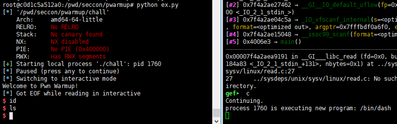

# pwarmup
### #rwx_segment #rop #pwn #pwntools

***\* 해당 [write up](https://github.com/mephi42/ctf/blob/master/2020.10.10-SECCON_2020_Online_CTF/pwarmup/pwnit.py) 을 참고하여 재정리***


rop 상황에서 pwntools 의 사용을 극대화 시킬 수 있었던 문제. 


우선 보호기법을 확인해보니 **RWX** 권한이 있는 영역이 있다고 한다.

**gdb** 로 확인해보면, `0x600000` 부분부터 `0x601000` 까지 **rwx** 권한이 있음을 알 수 있다. NX 도 안걸려있고, 저 부분이 쉘코드를 올릴 자리임을 알 수 있었다.


바이너리의 코드를 확인해보자.

```C
/*
    main.c
*/
#include <unistd.h>
#include <stdio.h>

int main(void) {
  char buf[0x20];
  puts("Welcome to Pwn Warmup!");
  scanf("%s", buf);
  fclose(stdout);
  fclose(stderr);
}

__attribute__((constructor)) // main 보다 먼저실행
void setup(void) {
  setvbuf(stdin, NULL, _IONBF, 0);
  setvbuf(stdout, NULL, _IONBF, 0);
  setvbuf(stderr, NULL, _IONBF, 0);
  alarm(60);
}

```

간단한 코드이다. 가젯확인결과 바이너리에 쓸만한 가젯들도 있고, rop 를 시전할 수 있을 것 같았다. 하지만, **libc** 를 leak 할만한 함수가 보이지 않아서 **libc** 를 이용하는 것은 생각하지않았다.

여기서 사용한 전략은 이렇다.

> BOF -> ROP gadget 을 이용한 `scanf("%s",0x600000);` 실행 -> scanf 실행 뒤에 `execve("/bin/sh");` 쉘코드 입력 -> 0x600000 실행



위의 전략대로 익스플로잇 코드를 짜고 로컬에서 실행해보았는데, 로컬에서 안되는 바람에 한참 막혔다.

아무리 명령어를 쳐도 결과물이 보이지않는다. 나중에 `fclose(stdout)` 때문이라는 것을 알았고, `ls>&0` 로 살아있는 `stdin` 디스크립터에 출력을 리다이렉트 시켜서 플래그를 얻을 수 있었다.


