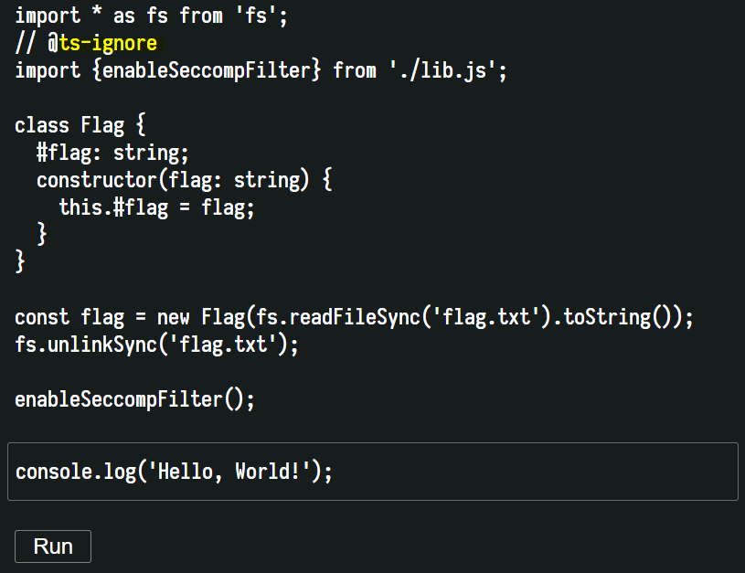
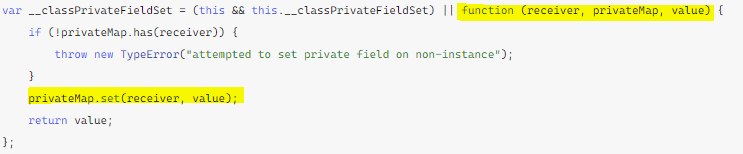
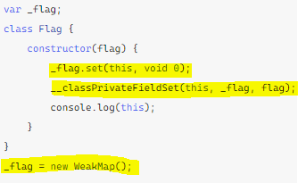
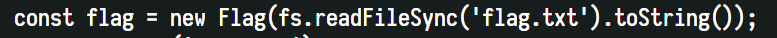
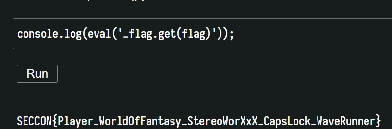

# beginner_capsule
### #weak_map #typescript #ESMAScript

문제는 다음과 같다. 해당 typescript 소스 밑에 원하는 소스를 덧붙힐 수 있는데 이를 이용하여 `flag.txt` 를 읽으면 된다.

이제 여기서 눈여겨 보아야할 것은 typescript 에서 **private** 로 멤버를 선언하는 방식이다. 

[Microsoft_Typescript : Private named instance fields](https://github.com/Microsoft/TypeScript/pull/30829)

다름아닌 `#` 을 멤버변수 앞에 붙여주면, 해당 멤버변수는 **private** 속성이 되어 외부에서 참조할 수 없다.

[트랜스파일 결과](https://www.typescriptlang.org/play?#code/MYGwhgzhAEBi4HNoG8BQ1oGIBmiBc0EALgE4CWAdggNzrTAD2FxJArsEQyQBS5gIEWlBAEoUdDEQAWZCADociaAF5ofGhPpMIDEAFM5IBgm7TZI2hgC+qG0A)

해당 링크와 사진을 참고하자. 이 결과에 따르면, `#` 을 붙여서 **private** 로 만든 변수는 위와 같이 **WeakMap** 의 형식으로 묶이게 된다.

그러면 이 한줄의 코드에서 `flag` 변수는 트랜스파일 된 **Flag** 클래스에서 `this` 가 되고, **WeakMap** 에서 `receiver` 를 담당하고, **fs** 로 읽어온 `flag.txt` 는 `value` 가 되어 하나의 **WeakMap** 을 형성할 것이다.

> 굳이 예를 들면 이렇다 => **_flag.set(flag,"flag.txt's string")**

그러면 불러오는 것은 **WeakMap** 의 `Getter` 를 이용하여 가져오면 될 것이다.

**[1] 참고자료:** [ES6 Class에서 private member를 정의하는 방법](https://gomugom.github.io/how-to-make-private-member/)

.

.

.

**Contact :** a42873410@gmail.com