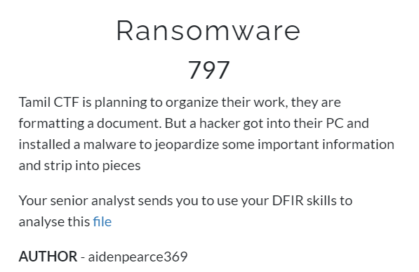
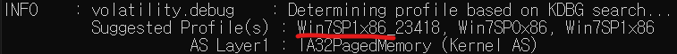
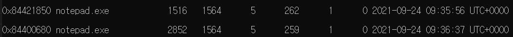

# Ransomeware

## #forensic #volatility

---

메모리덤프를 이용한 포렌식이다.

`volatility_2.6_win64_standalone.exe -f ransomeware.raw imageinfo`

우선 어느 운영체제에서 따온 메모리 덤프인지 찾아보았다.

**Windows 7 32비트** 임을 알 수 있었다.

`volatility_2.6_win64_standalone.exe -f ransomeware.raw --profile=Win7SP1x86_23418 pslist`

프로세스 탐색을 진행하였는데, 눈에 띄는 것은

