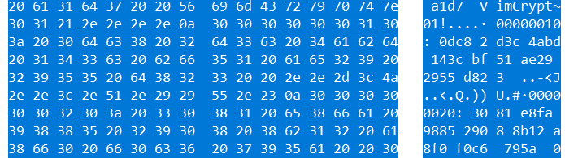

# vim bar

## #forensic #crack #vimCrypt

---

vim-bar.pcap 을 열어보면, vim 관련 문자열이 들어있는 패킷하나가 있다.



해당 패킷 데이터는 그냥 바이너리 데이터인듯 하여, 그대로 가져와서 vi 로 열어보았다.


vi 로 암호화가 걸려있다. vi 암호화에는 크게 3가지 방식이 있는데 아래와 같다.

[Sort of VimCrypt](./https://github.com/nlitsme/vimdecrypt#the-encryption-methods)

```
1. 구버전 PKZIP 알고리즘 암호화
header : VimCrypt~01!

2. Blowfish 암호화
header : VimCrypt~02!

3. CFM(Cipher Feedback Mode) 가 적용된 Blowfish2 암호화
header : VimCrypt~03!
```

우리가 받은 데이터는 구버전 PKZIP 알고리즘으로 암호화 되어있는 것을 파일 헤더를 통해 알 수 있다.

다행히 PKZIP 에 대해서 크랙하는 툴이 존재했다!

[VimCrypt Crack](https://github.com/nlitsme/vimdecrypt)


password 는 samantha 였다!!!

**flag : TamilCTF{vi_vii_viiim_lol}**
