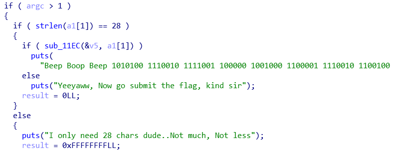
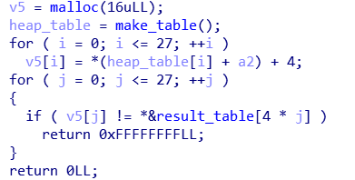

# GoldDigger

## #revsersing

---



main 함수의 모습이다.


main 함수의 첫 번째 조건이다. 인자를 받아오는데 받아오는 문자열의 길이는 28 바이트여야한다.



그리고 본격적으로 입력해준 문자열이 플래그인지 아닌지 검사를 하는 함수가 나온다.

로직은 위 사진이 끝이다.


여기서 **make_table** 함수는 위 사진과 같은 로직인데, data 영역에 있는 **test_data** 배열 값들을 18 과 xor 하여 새로운 데이터 배열을 만들어 낸다.

그리고 그 heap 배열을 전달받은 heap_table 의 값에 따라 28 바이트 문자열들의 위치를 점프해가면서 각 위치의 문자열 아스키에 4 를 더해준다.

그리고 그렇게 연산해준 28 바이트의 문자열이 result_table 의 데이터들과 값이 일치하면, 그 때 내가 인자로 준 문자열이 플래그가 된다.

그대로 역연산 시키면 간단한 문제이다.

```python
res = [0x70, 0x53, 0x6a, 0x71, 0x34, 0x7d, 0x81, 0x50, 0x63, 0x48, 0x68, 0x58, 0x59, 0x63,
       0x49, 0x6d, 0x47, 0x65, 0x4a, 0x73, 0x58, 0x72, 0x4c, 0x63, 0x79, 0x4b, 0x7f, 0x78]
test = [0x4, 0x18, 0xd, 0x2, 0xa, 0x9, 0x1b, 0x19, 0xc, 0x11, 0x1a, 0x6, 0xf, 0x12,
        0x15, 0x3, 0x5, 0x1, 0x7, 0xe, 0x0, 0x10, 0x14, 0x16, 0xb, 0x17, 0x8, 0x13]
flag = [0 for _ in range(0, 28)]
for i in range(0, 28):
    flag[test[i]] = chr(res[i]-4)
res_flag = ""
for i in flag:
    res_flag += i

print(res_flag)
```

**[결과]**


Thank y0u!

.  
.  
.  
.  
.

**Contact : a42873410@gmail.com**
