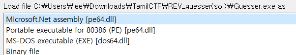
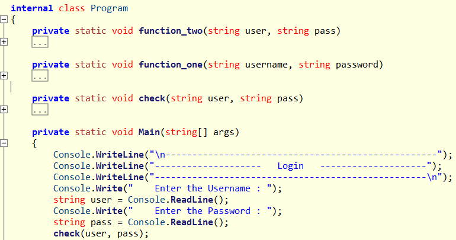
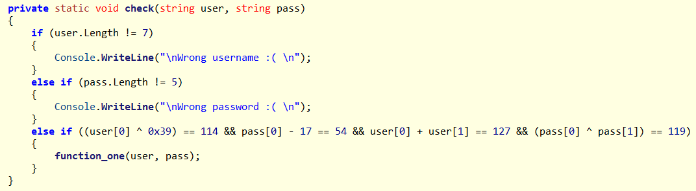
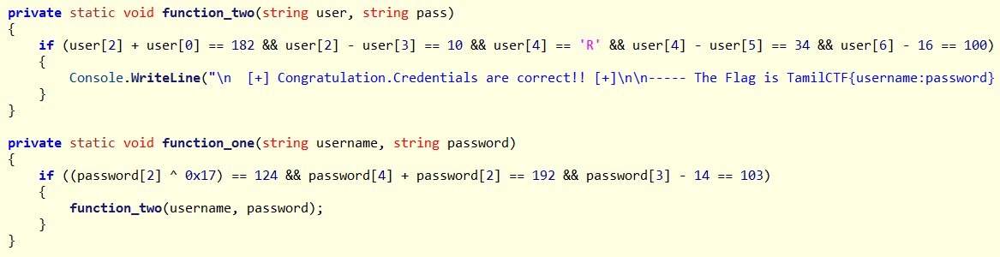
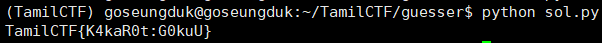

# Guesser

## #reversing #DotNet #IL Spy #z3

---



처음에 바이너리를 IDA로 열어보니 .Net 바이너리로 인식하길래 바로 IL Spy 툴로 열어보았다.



소스가 매우 정직하게 잘 나오는 것을 확인할 수 있다.

Main 함수를 보면 처음에 Login 을 진행하는 것을 알 수 있는데, check 로직은 생각보다 매우 간단하다.





생각보다 어려운 로직이 없어서 실제로 풀때는 눈으로 그냥 보고 풀었지만, 소스 첨부도 해본다.

```python
from z3 import *
s=Solver()
username=[BitVec('user_%i'%i,8) for i in range(0,7)]
password=[BitVec('pass_%i'%i,8) for i in range(0,5)]

#check part
s.add(username[0]^0x39==114)
s.add(username[0]+username[1]==127)
s.add(password[0]-17==54)
s.add(password[0]^password[1]==119)

#function_one part
s.add(password[2]^0x17==124)
s.add(password[2]+password[4]==192)
s.add(password[3]-14==103)

#function_two part
s.add(username[0]+username[2]==182)
s.add(username[2]-username[3]==10)
s.add(username[4]==ord('R'))
s.add(username[4]-username[5]==34)
s.add(username[6]-16==100)

s.check()
m=s.model()
result=sorted([(d, chr(m[d].as_long())) for d in m], key=lambda x:int(str(x[0]).split('_')[1]))
user=""
pw=""
for i in result:
    if(str(i[0]).split('_')[0]=="user"):
        user+=i[1]
    else:
        pw+=i[1]

print("TamilCTF{"+user+":"+pw+"}")
```

**[결과]**



Thank y0u!

.  
.  
.  
.  
.

**Contact : a42873410@gmail.com**
