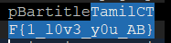

# HeyImAB

## #Android #ab file

---

안드로이드 백업파일 문제이다.

**.ab** 파일확장자는 처음 보았는데 안드로이드 백업파일이라고 한다.

[adbextractor](https://sourceforge.net/projects/adbextractor/) 링크

위의 extractor 를 이용하여 안의 파일을 추출할 수 있다.

`java -jar abp.jar unpack backup.ab res.tar`

해당 명령어로 추출을 하면, tar 파일 하나가 나온다.

그 파일안에 아래와 같은 경로의 파일을 살펴보다 플래그를 발견했다.

`apps\com.example.devpack\r\app_flutter\flutter_assets\kernel_blob.bin`

플래그는 다음과 같다.

Thank y0u!

.  
.  
.  
.  
.

**Contact : a42873410@gmail.com**
