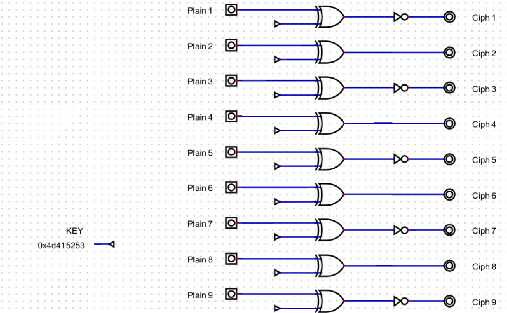
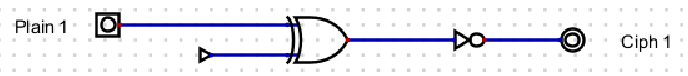
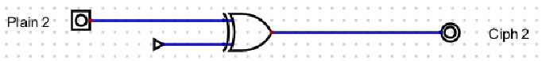

# digital_play

## #논리회로 #digital

---

misc 에 가까운 문제가 아닐런지...?

어렵지 않아서 장황한 설명은 하지 않는다.

우선 주어진 **.dig** 파일은 아래의 프로그램에서 열린다.

[Digital - 논리회로 설계 프로그램](https://github.com/hneemann/Digital)



digital.dig 파일을 Digital 프로그램에서 로드하면 위와 같이 나온다.

```txt
// enc.txt

00110110111111100000011000101
100001000000100000011000010101
001001111110101001110011001011
1111100000101010000110100010000
011011111011001110111011011001
1111100000101010110011100001100
010011111011001100100011110011
1100001101100001011101100110
0000010111100111100100011010001
```

그리고 같이준 이 파일을 보자.

여기서 게싱을 좀 해야하는데, 위에서부터 차례로 **Ciph 1** 부터 **Ciph 9** 까지의 데이터이다.

예시로 **Ciph 1** 과 **Ciph 2** 만 풀이한다.



위에서 **Ciph 1** 는 `00110110111111100000011000101` 이다.

우선 해당 회로 마지막에 not 이 적용되어있으므로 비트 반전을 한다음, xor 키 값인 `0x4d415253` 하고 xor 하면 **Plain 1** 이 나올 것이다.

```python
ciph1="00110110111111100000011000101"
hex((int(ciph1,2)^((1<<len(ciph1))-1))^0x4d415253)
# 결과 값 : 0x54616d69 = "Tami"
```



Not 이 붙지않은 경우는 더 간단하다.

```python
ciph2 = "100001000000100000011000010101"
hex(int(ciph2,2)^0x4d415253)
# 결과 값 : 0x6c435446 = "lCTF"
```

이런 식으로 나머지 이진수들도 변환하면 플래그가 나올 것이다.

```python
from binascii import *

ciph=["00110110111111100000011000101","100001000000100000011000010101","001001111110101001110011001011","1111100000101010000110100010000","011011111011001110111011011001","1111100000101010110011100001100","010011111011001100100011110011","1100001101100001011101100110","0000010111100111100100011010001"]

flag=""

for i in range(0,len(ciph)):
    ciph1=ciph[i]
    if(i%2==0):
        part=hex((int(ciph1,2)^((1<<len(ciph1))-1))^0x4d415253)
    else:
        part=hex(int(ciph1,2)^0x4d415253)
    flag+=unhexlify(part[2:]).decode()

print(flag)
```

**[결과]**

TamilCTF{D1g1T_CiRCu1T5_aRe_AwE50Me}
