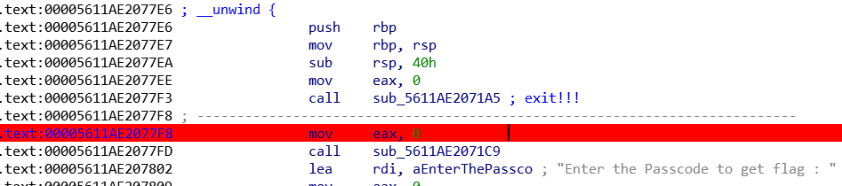
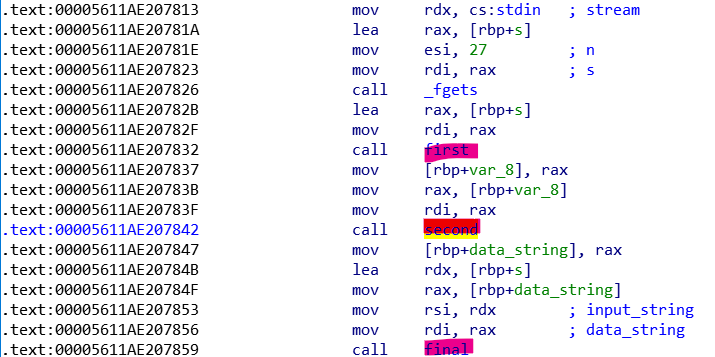

# foolme

## #z3 #reversing

---


우선 main 함수가 디컴파일 된 모습은 이러한데...

**sub_5611AE2071A5** 함수가 `exit(0)` 로 통하는 함수이다 보니 분명 다른 로직이 있다고 판단하였고...



어셈블리로 보면, 해당 함수 호출 이후에 추가 로직이 존재했다.

이 부분은 풀면서 적당히 우회 했다.



그리고 이후 로직은 **s** 변수에 문자열 입력하고, 해당 문자열에 대해서 **first, second, final** 함수를 통과해야된다.

### 1. first 함수


first 함수는 처음에 s 값을 받아서 26바이트 문자열을 갖고있는지 확인한다.

그리고 눈여겨 볼 것이 **dword_5611AE20A0A0** 해당 전역변수인데, 디컴파일 결과는 이상하게 나왔지만 사실 **dword_5611AE20A0A0** 를 시작으로 하여 **dword_5611AE20A104** 까지 이어지는 총 100바이트짜리 전역 배열이다.

`dword_5611AE20A0A0[100] 인 셈?`

해당 배열에 입력한 s 값과의 일련의 연산들을 하면서 값을 대입한다.


그리고 해당 전역배열을 return 한다.

### 2. second


main 함수에서 second 함수를 호출하는 부분이다.

**second** 함수는 인자 하나를 받는데 해당 인자를 **first** 함수에서 리턴한 전역배열 주소를 전달한다.


**second** 함수의 로직은 이게 끝이다.

**dword_5611AE20A120** 전역배열이 등장하는데, 로직은 간단하다.

우리가 **first** 에서 연산결과를 전달한 **dword_5611AE20A0A0** 배열의 끝 값 에서부터 역으로 **dword_5611AE20A120** 배열에 넣어주는 것이다.

```c
// 대강 아래와 같이 설명할 수 있겠다.
dword_5611AE20A120[0] = dword_5611AE20A0A0[25];
dword_5611AE20A120[1] = dword_5611AE20A0A0[24];
...
dword_5611AE20A120[24] = dword_5611AE20A0A0[1];
dword_5611AE20A120[25] = dword_5611AE20A0A0[0];
```

그리고 **dword_5611AE20A120** 배열을 리턴한다.

## 3. final


main 함수에서 **final** 함수를 호출하는 부분이다.

여기는 인자를 두 개 전달해주는데, 표현하면 `final(s,dword_5611AE20A120)` 가 된다.


**final** 함수의 마지막 부분을 먼저 보겠다.

결과적으로 dest 라는 문자열 값이 `TamilCTF{StRiNgs_C0mP4re5}` 가 되어야한다.

그리고 dest 는 **arr** 이라는 지역 배열에서 가져온다.

그러면 **arr** 이 어떤 값을 가지는지 위 소스에서 보자.


계산과정의 일부만 발췌하였다.

이 부분도 디컴파일이 조금 안된부분인데, 사실 v8, v9, v2, ... 변수들은 **arr** 배열의 요소들을 나타낸 것이다. 길이는 26 짜리 배열이다.

`arr[26]`

**arr\[26\]** 배열은 우리가 **second** 함수에서 리턴 받은 전역배열 값을 이용하여 초기화 한다.

결론적으로 `TamilCTF{StRiNgs_C0mP4re5}` 문자열을 이용해서 역연산 하는 것이 방법이다.

z3 를 이용하였다.

```python
from z3 import *
s = Solver()
flag = [BitVec('val_%i' % i, 8) for i in range(0, 26)]
res_flag = "TamilCTF{StRiNgs_C0mP4re5}"
s.add(ord(res_flag[0]) ^ 0x29 ^ 0x42 == flag[25])
s.add(((ord(res_flag[1])-19) ^ 1)+29 == flag[23])
s.add((ord(res_flag[2]) ^ 1) ^ 0xd == flag[22])
s.add(((ord(res_flag[4]) ^ 0x4a) << 2)//2 == flag[24])
s.add(((ord(res_flag[5]) ^ 7)+30)-29 == flag[18])
s.add(((ord(res_flag[6])-9) ^ 0x6e) ^ 0x46 == flag[20])
s.add((ord(res_flag[7]) ^ 0x7f) << 1 == flag[17])
s.add(((ord(res_flag[8])-47)*12)//8 == flag[16])
s.add(((ord(res_flag[9])-32) << 1) ^ 0x23 == flag[15])
s.add((ord(res_flag[10]) ^ 0x4d)+61 == flag[14])
s.add((ord(res_flag[11]) ^ 0x34)//2 == flag[13])
s.add(((ord(res_flag[12]) ^ 0x56) ^ 0x2d) << 2 == flag[21])
s.add(((ord(res_flag[13]) << 1)-64)+22 == flag[12])
s.add(((ord(res_flag[14])-2) ^ 0x60) << 4 == flag[10])
s.add(((ord(res_flag[15])-3) ^ 0x14)-5 == flag[11])
s.add((((ord(res_flag[16]) ^ 0x2a)-63)*2)-7 == flag[8])
s.add(196-((ord(res_flag[17])-14)*2) == flag[9])
s.add((ord(res_flag[18])*3)//2 == flag[4])
s.add((ord(res_flag[19])+9) ^ 0x29 == flag[7])
s.add((((ord(res_flag[20])-20) << 1) ^ 2)-69 == flag[6])
s.add((((ord(res_flag[21])+2)*2)-11) ^ 0x15 == flag[3])
s.add(((ord(res_flag[22]) ^ 0x52)*2)-15 == flag[5])
s.add(((ord(res_flag[23])-17)//2) ^ 31 == flag[1])
s.add(((ord(res_flag[24]) ^ 0x1f)*2) ^ 11 == flag[2])
s.add(((ord(res_flag[25]) ^ 0xb9)//4) == flag[0])
s.add(flag[19] == ord('_'))
s.check()
m = s.model()
res = ""
res_list = sorted([(d, m[d])
                  for d in m], key=lambda x: int(str(x[0]).split('_')[1]))

for i in range(0, len(res_list)):
    res += chr(res_list[i][1].as_long())

print(res)
```

위 소스를 실행하면 결과로 `15_tH15_eZP_r3vErrE_cHalL?` 를 뱉는데, 이걸 foolme 의 인자로 넣고 실행하면 실패한다.

주최측이 문제를 잘못낸건지... 힌트로 meaningful 한 string 이 나올 것이라고 하였다.

그래서.. 2바이트 정도 게싱해서 결과 문자열은 `15_tH15_eZY_r3vErsE_cHalL?` 이 나왔다.

**[결과]**


마지막 게싱에서 조금 ㅂㄷㅂㄷ..
