# EASY_CRACK_ME
### #z3

단순한 Crack Me 유형의 문제입니다.

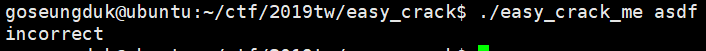

인자로 플래그를 받는데, 맞지않는 값을 넣으면 incorrect를 출력시켜줍니다.

바이너리를 뜯어보면 알겠지만 플래그 인증과정이 총 8개정도 있고, 모든 조건에 다 맞아야 정확한 플래그로 인지합니다.

***
* **첫 번째 조건**

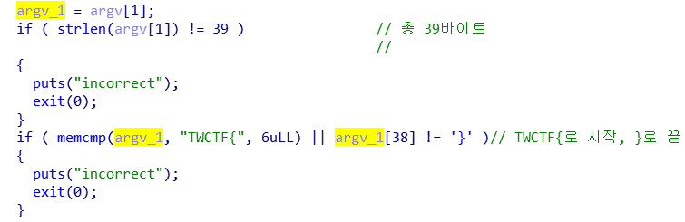

플래그길이는 총 39바이트여야하며, `TWCTF{` 로 시작하여 `}` 로 끝나야합니다.

***
* **두 번째 조건**

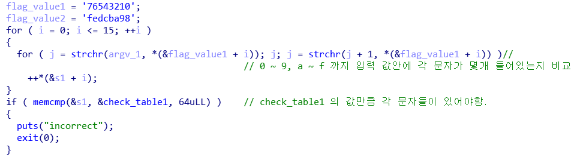

우선 `0123456789abcdef` 의 표본이 될 문자열이 주어집니다.
그리고 반복문으로 순회하면서 인자로 준 문자열에 0이 몇 개 있는지.., 1이 몇 개 있는지.., 2가 몇 개 있는지.. ~~~~~

s1 배열에 순서대로 개수를 입력 후에 그 배열이 check_table1과 같으면 통과입니다.

***
* **세 번째 조건**

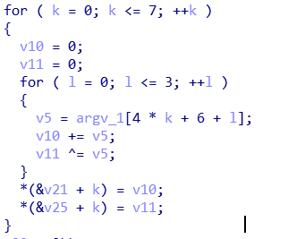

세 번째, 네 번째 조건같은 경우에는 비슷한데요.
세 번째는 입력한 인자 값을(총 39바이트의 길이) 인덱스 6에서 37까지 for문을 통해 돕니다.

```
(for문 진행방향) =>
argv[6] argv[7] argv[8] argv[9]
argv[10] argv[11] argv[12] argv[13]
argv[14] argv[15] argv[16] argv[17]

. . . (생략)

argv[34] argv[35] argv[36] argv[37] 
```

그리고 4번마다 (예를 들면 argv[6]~argv[9]까지) v10과 v11을 0으로 초기화 하고 누적으로 더하고 누적으로 xor 연산을 합니다.

그리고 그 v10과 v11값을 v21과 v25 배열에 넣어줍니다.


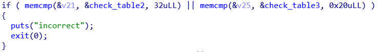

그리고 v21과 v25 배열을 check_table2와 check_table3과 비교하여 같은 배열이면 통과합니다.

***
* **네 번째 조건**

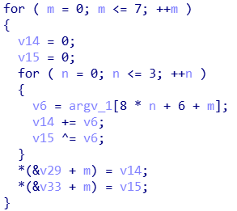

네 번째 조건도 위와 유사합니다.
입력한 인자 값을(총 39바이트의 길이) 인덱스 6에서 37까지 for문을 통해 돕니다.  이 때 순회하는 부분은 동일하지만 어떻게 순회하느냐가 조금 다릅니다.

```
(for문 진행방향) =>
argv[6] argv[14] argv[22] argv[30]
argv[7] argv[15] argv[23] argv[31]
argv[8] argv[16] argv[24] argv[32]

... (생략)

argv[13] argv[21] argv[29] argv[37]
```

차이가 보이시나요?

아무튼 이렇게 진행하여 4번마다 누적된 값과 xor한 값(v14와 v15)들을 v29와 v33 배열에 넣습니다.


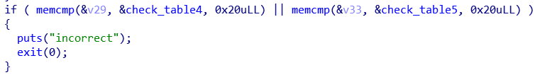

그리고 v29와 v33 배열을 check_table4와 check_table5와 비교하여 동일하면 통과 !

***
* **다섯 번째 조건**

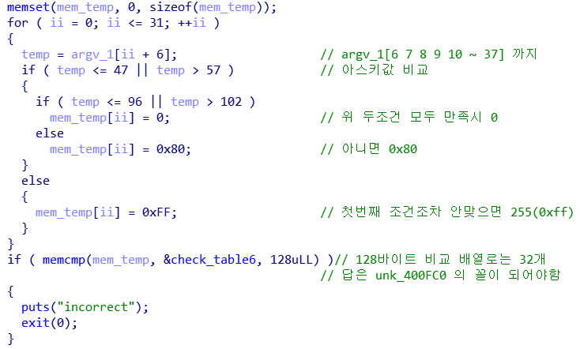

다섯 번째 조건은 입력한 인자 값을 argv[6]부터 argv[37]까지 비교를 하는데 각 문자마다의 아스키 값에 따라 mem_temp 배열에 들어가는 값이 달라집니다.

입력 값의 각 문자가 **97이상, 102이하** 이면 0x80을,
입력 값의 각 문자가 **48이상, 57이하** 이면 0xff를,
그 외의 경우에는 0x00을 넣습니다.

그리고 mem_temp배열과 check_table6가 동일하면 통과인데 0x00은 check_table6에 없기에 생략합니다.

***
* **여섯 번째 조건**

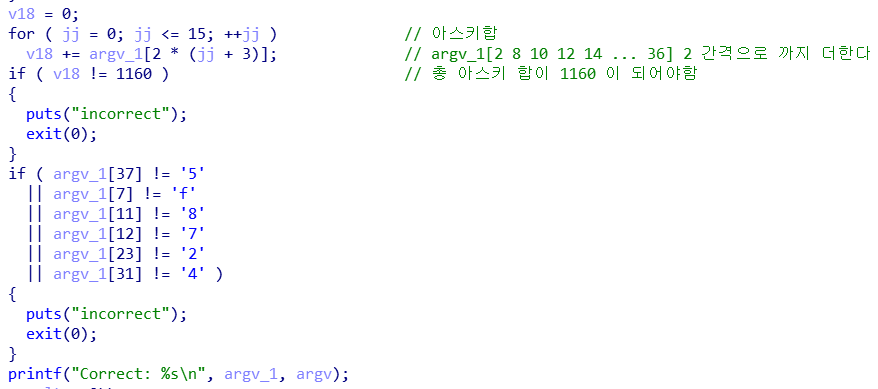

마지막 조건입니다.

argv[6] 부터 argv[37] 까지 순회를 하면서 각 문자에 대한 아스키 값을 v18에 누적시킵니다.

결론적으로 TWCTF{} 의 중괄호 안에 있는 문자들의 아스키 합이 1160이어야 통과입니다.

그리고 argv[37],argv[7],argv[11],argv[12],argv[23],argv[31]에 대한 문자도 알려줍니다.

***

그렇게 모든 조건을 통과하면 Correct라고 뜰 것입니다.


이 문제를 푸는데 `z3` 가 필요하겠다 싶어서 바로 소스를 짰습니다.

```python
#-*-coding:utf-8-*-
from z3 import *
check1=[3,2,2,0,3,2,1,3,3,1,1,3,1,2,2,3]
check2=[0x15e,0xda,0x12f,0x131,0x100,0x131,0xfb,0x102]
check3=[0x52,0xc,0x1,0xf,0x5c,0x5,0x53,0x58]
check4=[0x129,0x103,0x12b,0x131,0x135,0x10b,0xff,0xff]
check5=[0x1,0x57,0x7,0xd,0xd,0x53,0x51,0x51]
check6=[0x80,0x80,0xff,0x80,0xff,0xff,0xff,0xff,0x80,0xff,0xff,0x80,0x80,
        0xff,0xff,0x80,0xff,0xff,0x80,0xff,0x80,0x80,0xff,0xff,0xff,0xff,0x80,
        0xff,0xff,0xff,0x80,0xff]
flag=[BitVec('val_%i'%i,8) for i in range(0,39)]
#make flag array

s=Solver()
s.add(flag[0]==ord('T'))
s.add(flag[1]==ord('W'))
s.add(flag[2]==ord('C'))
s.add(flag[3]==ord('T'))
s.add(flag[4]==ord('F'))
s.add(flag[5]==ord('{'))
s.add(flag[38]==ord('}'))
index=0
for i in "0123456789abcdef":
        cnt=0
        for j in flag:
                '''
                if(j==ord(i)):
                        cnt+=1
                '''
                cnt+=If(j==ord(i),1,0)
                #z3 내장함수 If
        s.add(cnt==check1[index])
        index+=1
# first condition

for i in range(0,8):
        tmp1=0
        tmp2=0
        for j in range(0,4):
                tmp1+=flag[4*i+6+j]
                tmp2^=flag[4*i+6+j]
        s.add(tmp1==check2[i])
        s.add(tmp2==check3[i])
# second third condition

for i in range(0,8):
        tmp1=0
        tmp2=0
        for j in range(0,4):
                tmp1+=flag[8*j+6+i]
                tmp2^=flag[8*j+6+i]
        s.add(tmp1==check4[i])
        s.add(tmp2==check5[i])
#fourth fifth condition

for i in range(0,32):
        if(check6[i]==0x80):
                s.add(And(flag[i+6]>96,flag[i+6]<=102))
                #z3 내장함수 And
        elif(check6[i]==0xff):
                s.add(And(flag[i+6]>47,flag[i+6]<=57))
#       elif(check6[i]==0xff):
#sixth condition

summ=0
for i in range(0,16):
        summ+=flag[2*(i+3)]
s.add(summ==1160)
s.add(flag[37]==ord('5'))
s.add(flag[7]==ord('f'))
s.add(flag[11]==ord('8'))
s.add(flag[12]==ord('7'))
s.add(flag[23]==ord('2'))
s.add(flag[31]==ord('4'))
#last condition

print(s.check())
m=s.model()
print(sorted([(d, m[d]) for d in m], key=lambda x:int(str(x[0]).split('_')[1])))

```
[result]

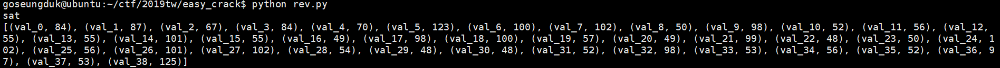
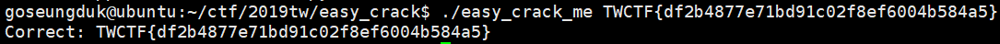


Thank y0u!  

.  
.  
.  
.  
.  

**Contact : a42873410@gmail.com**