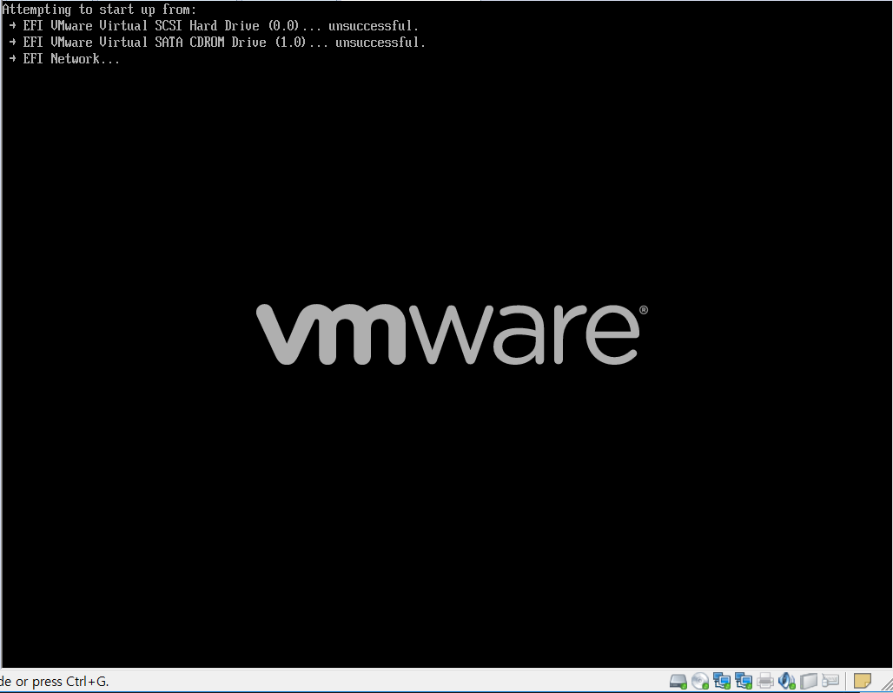
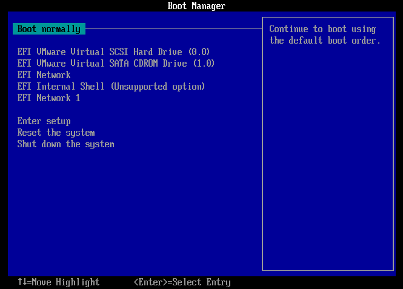

# EBC
#### #UEFI  

처음엔 ebc라는 바이너리를 딱 하나 줍니다.

처음에는 elf인줄 알고 실행시켰는데 실행이 되지않습니다.

그래서 무슨 파일인고 하니

PE32+ 의 형식을 가진 EFI 파일이였습니다.

사실 처음보는 형태의 파일이라 구동시키는데까지도 굉장히 오래걸렸습니다.  

몇 시간 삽질해서 EFI Shell에서 .efi 파일이 구동된다는 사실을 알았습니다.
<dl>
      
</dl>

***

<EFI Shell 구축 및 .efi 구동방법>

VM Ware를 사용하였습니다.

***

  
New Virtual Machine 탭에서 Typical 을 선택 후 Next를 눌러줍니다.

***

os는 나중에 깔기로 해줍니다.

***

설치할 os는 Windows 7 x64로 하였습니다.

***
그 뒤의 나머지 설정들은 쭉 Next 해주시면 됩니다.

그리고 VM 설치한 디렉토리로 가면 .vmx 파일이 생성되어있을겁니다.

***

***

이제 이 파일에 하나만 추가할 것입니다.

***

` firmware="efi" ` 이 구문을 파일안에 추가만 해주세요.

***

그리고 설치된 VM을 구동하면 자동으로 EFI Shell을 실행할 수 있는 부트매니저로 진입할 것입니다.

***

이렇게 한 길면 3분여의 시간정도 로딩할 것입니다.

기다리는동안 유튜브 한 편 보고오세요 :)

***

부트매니저가 구동되었습니다! 

EFI Shell로 진입하기전에 준비해야할 것이 있습니다.

바로 FAT32로 포맷된 부팅디스크인데요. 이건 각자 iso파일 잘 받아서 부팅디스크로 만들어보세용.

그리고 이 때, ebc.efi 파일도 부팅디스크안에 따로 넣어줘야합니다.

만들었다면, EFI Shell 에 진입 후, USB를 꽂아주세요.
그리고 다시 `exit` 명령어로 나왔다가 다시 들어가주세요.

그러면 아래와 같이 fs0: 로 인식이 된 것이 보일 겁니다.

***

`fs0:` 로 부팅디스크로 들어갑니다.

ebc.efi 가 저장된 디렉토리로 가서 실행시켜봅니다.

***

무사히 실행이 됩니다! XD

하지만 키를 입력하면 뭔가 바이너리가 씹힌듯이 멈춥니다...

아무래도 ebc.efi 파일을 까봐야겠습니다.

***
### 하지만 어떤 디버깅 툴을 쓰죠???

이 부분에서도 삽질 굉장히 했습니다. 

.elf는 디버깅해봤어도 .efi는 난생처음이었기에...  
(참고로 IDAx64 에서는 안열리던데 방법을 아시는 분은 알려주세요 ㅠㅠ)

아무튼 이것저것 툴들을 찾아보다가 발견한게 있었는데...!

[Radare2 official ](https://rada.re/r/)  
[Radare2를 설명해준 블로그](https://cpuu.postype.com/post/838572)

설치는 문서 찾아보면 간단히 할 수 있습니다!

***

